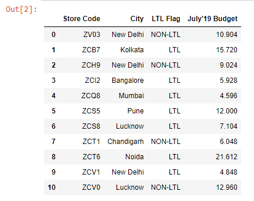
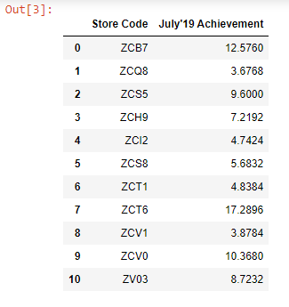
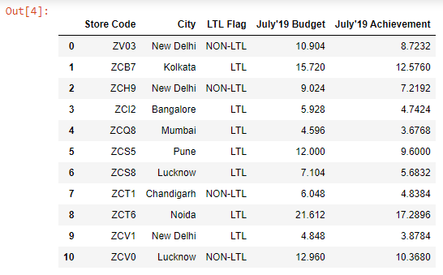

I have an Excel workbook named ~~budget.xlsx~~, which has two worksheets: ~~sheet1~~ & ~~sheet2~~.

Let’s read both the worksheets into DataFrames:

```py {numberLines}
import pandas as pd

budget1 = pd.read_excel("budget.xlsx", sheet_name="sheet2").drop_duplicates()

budget1
```

**Output:**



```py {numberLines}
budget2 = pd.read_excel("budget.xlsx", sheet_name="sheet1").drop_duplicates()

budget2
```

**Output:**



Note that both the DataFrames have the ~~Store Code~~ column in common.

Our goal is to join the ~~July’19 Achievement~~ column from the ~~budget2~~ DataFrame to the ~~budget 1~~ DataFrame.

We can do so using the ~~join()~~ method.

The ~~Store Code~~ column, _present in both the DataFrames_, will act as the key for the joining operation.

```py {numberLines}
budget1.set_index(keys="Store Code").join(budget2.set_index(keys="Store Code")).reset_index()
```

###### Learn how to convert a column into an index in my blog post [here](https://hemanta.io/pandas-set-index-andreset-index-methods/).

**Output:**


