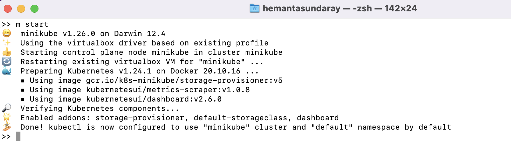

```toc

```

In this guide, we will learn how to run an application inside a Docker container on top of a single-node Kubernetes cluster. To be precise, we will run a simple Node.js web application that
we learnt how to package as a container image in my blog post [here](https://hemanta.io/containerize-dockerize-a-nodejs-web-application-part-1-building-the-image/) & [here](https://hemanta.io/containerize-dockerize-a-nodejs-web-application-part-2-running-the-image-as-a-container/).

The container image is stored in the ~~sundaray/node-server~~ repository on Docker Hub. As the repository has public read rights, you can work with the same image for this tutorial. Or else, you are free to work with your own image on Docker Hub.

This guide requires that you have a basic understanding of Kubernetes architecture & key Kubernetes objects: Pods & Services. In addition, you should have Minikube & Kubectl installed on your machine.

We will use Minikube to start a virtual machine & run a Kubernetes cluster inside it. And we will use Kubectl - a command line client - to interact with the Kubernetes cluster. Kubectl will issue REST requests to the Kubernetes API server running on the master node.

So, let’s get started.

### Starting a Kubernetes cluster

First, we will start a Kubernetes cluster with Minikube with the command ~~minikube start~~.

```sh {numberLines}
minikube start
```



Starting a Minikube virtual machine takes some time. So, don’t interrupt the terminal.

### Verifying the cluster

To verify that the cluster is working, we can use the ~~kubectl cluster info~~ command.

```sh {numberLines}
kubectl cluster info
```


This shows that the cluster is up and running.

### Listing cluster nodes

To view the nodes in the cluster, we can run the ~~kubectl get nodes~~ command.

```sh {numberLines}
kubectl get nodes
```


We can see that we have only one node. Its status is ready and it is ready to accept applications for deployment.

We can retrieve detailed information about our nodes using the following command:

```sh {numberLines}
kubectl describe node
```


The output of the ~~kubectl describe node~~ command is quite large. The output you see above is a cut down version of the actual output.

### Creating a Deployment object

Now that our cluster is up & running, we will deploy our application by creating a Kubernetes Deployment object.

> A Deployment is an object that represents an application running in our cluster.

First we will create a Deployment configuration ~~.yaml~~ file and then we will pass the file as an argument to the ~~kubectl apply~~ command.

Create a directory named ~~node-server~~ & open the directory in a code editor. Inside the directory create a file named ~~node-server-deployment.yaml~~.

Copy and paste the code sample below in the ~~node-server-deployment.yaml~~ file.

```yml:title=node-server/node-server-deployment.yaml {numberLines}
apiVersion: apps/v1
kind: Deployment
metadata:
 name: node-web-server-deployment
spec:
 replicas: 1
 selector:
   matchLabels:
     app: node-server
 template:
   metadata:
     labels:
       app: node-server
   spec:
     containers:
       - name: node-server
         image: sundaray/node-server:v1
           ports:
             - containerPort: 8000

```

Make sure that the indentation is proper.

The YAML file shows the required fields and object spec for our Kubernetes deployment:

- ~~apiVersion~~ - Which version of the Kubernetes API you're using to create this object
- ~~kind~~ - What kind of object you want to create
- ~~metadata~~ - Data that helps uniquely identify the object
- ~~.metadata.name~~: Represents the name of the Deployment
- ~~spec~~: What state you desire for the object
- ~~.spec.replicas~~: The number of replicated pods that will be created by the Deployment
- ~~.spec.selector~~: Defines how the Deployment decides which Pods to manage. The label we have selected is defined in the Pod template. (~~app: node-server~~).

The ~~template~~ field contains the following sub-fields:

- The pods are labeled using the ~~.metadata.labels~~ field.
- ~~.template.spec~~: Indicates that the Pods will run one container, ~~node-server~~, which will run the ~~node-server~~ Docker Hub image at version ~~v1~~.
- ~~containerPort~~: Refers to the port where the app is exposed inside the container. The ~~containerPort~~ must match the ~~targetPort~~ in our Service configuration file.

> Labels are a simple, yet incredibly powerful, Kubernetes feature for organizing not only pods, but all other Kubernetes resources. A label is an arbitrary key-value pair you attach to a resource, which is then utilized when selecting resources using label selectors (resources are filtered based on whether they include the label specified in the selector). A resource can have more than one label, as long as the keys of those labels are unique within that resource. You usually attach labels to resources when you create them, but you can also add additional labels or even modify the values of existing labels later without having to recreate the resource.

Let’s create the Deployment by running the following command:

```sh {numberLines}
kubectl apply -f node-server-deployment.yaml
```


We can run ~~kubectl get deployments~~ to check if the Deployment was created.

```sh {numberLines}
kubectl get deployments
```


We can see that there is 1 deployment running a single instance of our app. The app is running inside a Docker container on the node.

The deployment has the following fields:

- ~~NAME~~: Lists the names of the Deployments in the namespace.
- ~~READY~~: Displays how many replicas of the application are available to your users. It follows the pattern ready/desired.
- ~~UP-TO-DATE~~: Displays the number of replicas that have been updated to achieve the desired state.
- ~~AVAILABLE~~: displays how many replicas of the application are available to your users.
- ~~AGE~~: displays the amount of time that the application has been running.

To see the rollout status, run ~~kubectl rollout status deployment/node-web-server-deployment~~.


To see the ReplicaSet (rs) created by the Deployment, run ~~kubectl get rs~~.


ReplicaSet output shows the following fields:

- ~~NAME~~: Lists the names of the ReplicaSets in the namespace.
- ~~DESIRED~~: Displays the desired number of replicas of the application, which you define when you create the Deployment. This is the desired state.
- ~~CURRENT~~: Displays how many replicas are currently running.
- ~~READY~~: Displays how many replicas of the application are available to your users.
- ~~AGE~~: Displays the amount of time that the application has been running.

Notice that the name of the ReplicaSet is always formatted as ~~[DEPLOYMENT-NAME]-[RANDOM-STRING]~~.

To see the labels automatically generated for each Pod, run ~~kubectl get pods --show-labels~~.


### Exposing the application outside the Kubernetes cluster

We will make our application receive external traffic using a Service object, which we will create using a Service configuration ~~.yaml~~ file.

In the ~~node-server~~ directory, create a file named ~~node-server-service.yaml~~.

Copy and paste the code sample below in the file.

```yml:title=node-server/node-server-service.yaml {numberLines}
apiVersion: v1
kind: Service
metadata:
  name: node-web-server-port
spec:
  type: NodePort
  ports:
    - port: 3050
      targetPort: 8000
      nodePort: 31515
  selector:
    app: node-server
```

Note that we have used a Service type of ~~NodePort~~, which will make our Service accessible from outside the cluster using ~~NodeIP:NodePort~~.

###### To understand the concept of Services in Kubernetes and what different fields in a Service configuration file refer to, check out my blog post [here](https://hemanta.io/what-is-a-service-object-in-kubernetes/).

Let’s create a Service object:

```sh {numberLines}
kubectl apply -f node-server-service.yaml
```


Now let’s list the current services from our cluster:

```sh {numberLines}
kubectl get services
```


To find out the IP address and the port from where we can connect to our application, we can use the following command:

```sh {numberLines}
minikube service node-web-server-port
```


Note that ~~node-web-server-port~~ is the name of our service.

Visit the URL as displayed by the output above and we will see the response from our application - "Hello From Node".


