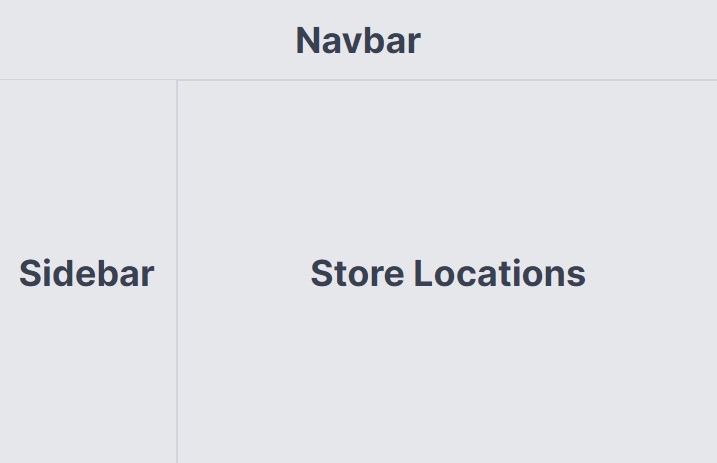
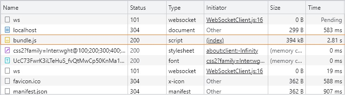
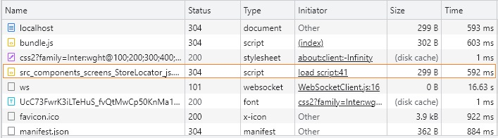
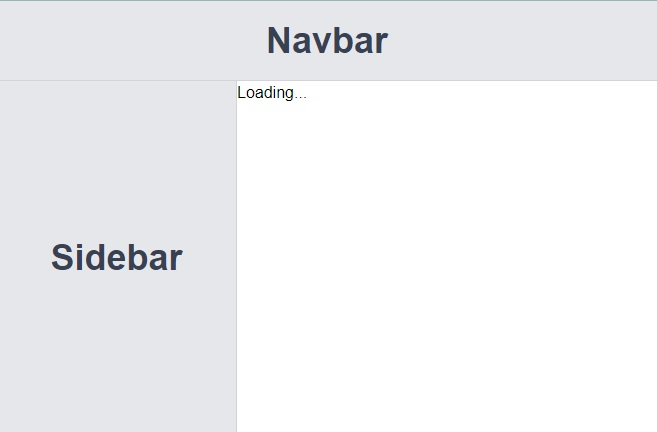

Let’s consider a real-world app with 3 components: ~~\<Navbar>~~, ~~\<Sidebar>~~ & ~~\<StoreLocator>~~.



Let’s assume that the ~~\<StoreLocator>~~ component displays a map with the locations of different stores. The component is large as it is filled with complex logic and functionality.

The code snippets of the 3 components are as follows:

```jsx:title=App.js {numberLines}
import React, { Suspense } from "react";
import Navbar from "./components/screens/Navbar";
import Sidebar from "./components/screens/Sidebar";
import StoreLocator from "./components/screens/StoreLocator";

const App = () => {
  return (
    <>
      <Navbar />
      <div className="flex">
        <Sidebar />
        <StoreLocator />
      </div>
    </>
  );
};

export default App;
```

```jsx:title=Navbar.js {numberLines}
import React from "react";

const Navbar = () => {
  return (
    <div className="w-full h-20 border-b border-gray-300 bg-gray-200 flex justify-center items-center text-gray-700 text-4xl font-bold">
      Navbar
    </div>
  );
};

export default Navbar;
```

```jsx:title=Sidebar.js {numberLines}
import React from "react";

const Sidebar = () => {
  return (
    <div className="w-60 h-[calc(100vh-5rem)] border-r border-gray-300 bg-gray-200 flex justify-center items-center text-gray-700 text-4xl font-bold">
      Sidebar
    </div>
  );
};

export default Sidebar;
```

```jsx:title=StoreLocator.js {numberLines, 6-8}
import React from "react";

const StoreLocator = () => {
  const delay = () => {
    let i = 0;
    while (i < 10000000000) {
      i++;
    }
    return "Store Locations";
  };
  return (
    <div className="w-full border border-gray-300 bg-gray-200 flex justify-center items-center text-gray-700 text-4xl font-bold">
      {delay()}
    </div>
  );
};

export default StoreLocator;
```

Currently, our app is taking a long time to load because of the ~~\<StoreLocator>~~ component. Notice that we have artificially delayed the rendering of the ~~\<StoreLocator>~~ component using a ~~while~~ loop.

So, what can we do to improve the performance of our app? Specifically, what can we do to make our app load quickly on the first render?

At present, the ~~\<StoreLocator>~~ is part of our app’s main bundle, which is 394 kB in size. This means that we download all of our application code when we load our app for the first time.



> Note: When we build a React app all of our code is gathered into one file called **bundle**, which users download when they request our app.

The first step to making our app load faster is to split the ~~\<StoreLocator>~~ component into its own chunk (a smaller JavaScript file), so that it is sent to the users separately from the main bundle.

To achieve this, we can use ~~React.lazy()~~, which has the following syntax:

```jsx {numberLines}
const StoreLocatorMap = React.lazy(() =>
  import("./components/screens/StoreLocator")
)
```

~~React.lazy()~~ accepts a callback function as an argument. Inside the callback, we use the ~~import()~~ function.

```jsx:title=StoreLocator.js {numberLines, 4-6, 14-14}
import React from "react";
import Navbar from "./components/screens/Navbar";
import Sidebar from "./components/screens/Sidebar";
const StoreLocatorMap = React.lazy(() =>
  import("./components/screens/StoreLocator")
);

const App = () => {
  return (
    <>
      <Navbar />
      <div className="flex">
        <Sidebar />
        <StoreLocatorMap />
      </div>
    </>
  );
};

export default App;
```

Above, ~~React.lazy()~~ returns the ~~\<StoreLocatorMap>~~ component. Now, when we load the app, we will download this component as its own chunk, separate from the main bundle. We can see this chunk in the Developer Tool’s Network Tab:



Also, notice that we have decreased the main bundle size to 302B.

However, our app is still taking the same amount of time to load. This is because React is not able to load the ~~\<StoreLocator>~~ component separately from the main bundle. Instead, React waits until all chunks are downloaded, after which it displays our app.

To tell React to load the rest of our app first, and then insert our lazily loaded component, we can use the ~~\<Suspense>~~ component from React.

The ~~\<Suspense>~~ component instructs React to load every part of our app except the components loaded with ~~React.lazy()~~. While those components download, ~~\<Suspense>~~ shows a loading state. Once the lazily loaded component is ready, ~~\<Suspense>~~ inserts the component into our app.

Let’s add the ~~\<Suspense>~~ component:

```js:title=App.js {numberLines, 1-1, 14-14, 16-16}
import React, { Suspense } from "react";
import Navbar from "./components/screens/Navbar";
import Sidebar from "./components/screens/Sidebar";
const StoreLocatorMap = React.lazy(() =>
  import("./components/screens/StoreLocator")
);

const App = () => {
  return (
    <>
      <Navbar />
      <div className="flex">
        <Sidebar />
        <Suspense fallback={<p>Loading...</p>}>
          <StoreLocatorMap />
        </Suspense>
      </div>
    </>
  );
};

export default App;
```

Above, the ~~\<Suspense>~~ component has the ~~\<StoreLocatorMap>~~ component, imported with ~~React.lazy()~~ as its child.

~~\<Suspense>~~ also takes one prop named ~~fallback~~, which is React component used to display a loading state while its children load. In our code snippet above, while ~~\<StoreLocatorMap>~~ is downloading, the UI displays a paragraph with the text ~~Loading…~~ until the ~~\<StoreLocatorMap>~~ component is ready to be displayed.



When importing components with ~~React.lazy()~~, we should always wrap the lazily loaded component in React’s ~~\<Suspense>~~ component, so that the lazily loaded component renders into our app after the rest of our app.

Now we can see that our app loads quickly on the first render, then gets filled in with the ~~\<StoreLocatorMap>~~ component, which is expensive to load.
