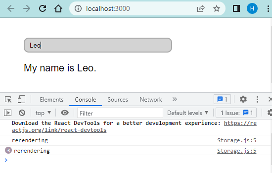
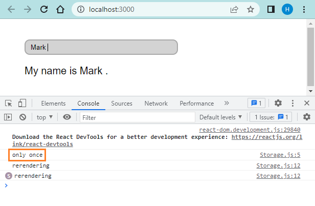

To understand the concept of lazy initial state, we must keep in mind the following React feature:

```js {numberLines}
const [state, setState] = useState(initialState)
```

> React uses the ~~initialState~~ argument passed to the ~~useState~~ hook **ONLY during the first render**. For subsequent re-renders, ~~initialState~~ is disregarded - the first value returned by ~~useState~~ is always the most recent state after applying updates.

With this information mind, let’s consider the example below:

```js {numberLines, 8-8}
import React, { useEffect, useState } from "react"

const App = ({ initialName = "" }) => {
  const fetchDataFromLocalStorage = () => {
    return localStorage.getItem("name")
  }

  const [name, setName] = useState(fetchDataFromLocalStorage() || initialName)

  useEffect(() => {
    localStorage.setItem("name", name)
  }, [name, setName])

  const handleChange = e => {
    setName(e.target.value)
  }

  return (
    <div className="lazy">
      <input value={name} onChange={handleChange} />
      <p>{`My name is ${name}.`}</p>
    </div>
  )
}

export default App
```

On line 8, notice that the ~~fetchDataFromLocalStorage()~~ function (responsible for reading data from localStorage) will be called on every render, but we are using the result returned from the function only during the first render, This is a React feature that we talked about at the beginning of the post.

We can prove this by adding a ~~console.log~~ statement inside the ~~fetchDataFromLocalStorage~~ function.

```js {numberLines, 5-5}
import React, { useEffect, useState } from "react"

const App = ({ initialName = "" }) => {
  const fetchDataFromLocalStorage = () => {
    console.log("rerendering")
    return localStorage.getItem("name")
  }

  const [name, setName] = useState(fetchDataFromLocalStorage || initialName)

  useEffect(() => {
    localStorage.setItem("name", name)
  }, [name, setName])

  const handleChange = e => {
    setName(e.target.value)
  }

  return (
    <div className="lazy">
      <input value={name} onChange={handleChange} />
      <p>{`My name is ${name}.`}</p>
    </div>
  )
}

export default App
```

Now, if we start typing inside the input box, the ~~onChange~~ event will trigger the ~~handleChange~~ event handler, which in turn will call the ~~setName~~ state setter function, causing the component to rerender. And every time the component rerenders, the ~~fetchDataFromLocalStorage~~ function is called and we log the value “rerendering” to the console.



**Calling the ~~fetchDataFromLocalStorage~~ function on every render is problematic because reading from localStorage can be slow, creating a performance bottleneck. More importantly, React will use the value returned from the function only during the first render. So the additional localStorage reads on subsequent re-renders are wasted effort.** Therefore, we need to figure out a way to call the ~~fetchDataFromLocalStorage~~ function ONLY once.

How do we do this?

The solution is simple: we need to pass the ~~fetchDataFromLocalStorage~~ function as an initializer function to ~~useState~~.

```js {numberLines, 8-8}
import React, { useEffect, useState } from "react"

const App = ({ initialName = "" }) => {
  const fetchDataFromLocalStorage = () => {
    return localStorage.getItem("name")
  }

  const [name, setName] = useState(fetchDataFromLocalStorage || initialName)

  useEffect(() => {
    localStorage.setItem("name", name)
  }, [name, setName])

  const handleChange = e => {
    setName(e.target.value)
  }

  return (
    <div className="lazy">
      <input value={name} onChange={handleChange} />
      <p>{`My name is ${name}.`}</p>
    </div>
  )
}

export default App
```

As we can see, instead of calling the ~~fetchDataFromLocalStorage~~ function, we are simply passing a reference to it inside ~~useState~~.

Now, the function will be called only ONCE - during the first render. Let’s prove this by adding two ~~console.log~~ statements: one inside the ~~fetchDataFromLocalStorage~~ function and one inside the ~~useEffect~~ hook.

```js {numberLines, 5-5, 12-12}
import React, { useEffect, useState } from "react"

const App = ({ initialName = "" }) => {
  const fetchDataFromLocalStorage = () => {
    console.log("only once")
    return localStorage.getItem("name")
  }

  const [name, setName] = useState(fetchDataFromLocalStorage || initialName)

  useEffect(() => {
    console.log("rerendering")
    localStorage.setItem("name", name)
  }, [name, setName])

  const handleChange = e => {
    setName(e.target.value)
  }

  return (
    <div className="lazy">
      <input value={name} onChange={handleChange} />
      <p>{`My name is ${name}.`}</p>
    </div>
  )
}

export default App
```

Let’s type something in the input box.



As we can see the text “only once” is logged to the console only once. This confirms that the ~~fetchDataFromLocalStorage~~ function is being called ONLY once, as we require.

Now, you know how to use the concept of lazy state initialization when performing expensive calculations. In our case, we used lazy state initialization to avoid a performance bottleneck arising out of reading into localStorage on every render.
