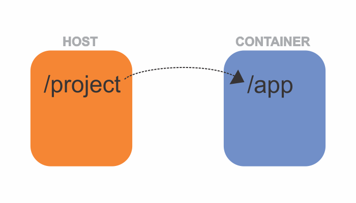

In development, whenever you make some changes in your web files, you would want the changes to reflect immediately in the browser without having to rebuild the image and restart the container.

You can achieve this by mapping your current directory with the working directory inside the container, with the help of Docker volumes.



All you need to do is to add the line as highlighted in the code snippet below while running your container.

```sh {numberLines, 2-2}
docker run -d --name web-app \
    -v $(pwd):/app \
    -p 8000:8000 \
    app-iamge
```

- **$(pwd):** This is the current working directory.
- **/app:** This is the working directory inside the container. This is the same directory that you have mentioned as the value of ~~WORKDIR~~ in your Dockerfile.

This way, the container will always contain the latest changes that you make to your source code, without the need to rebuild the image and rerun the container after every change.
