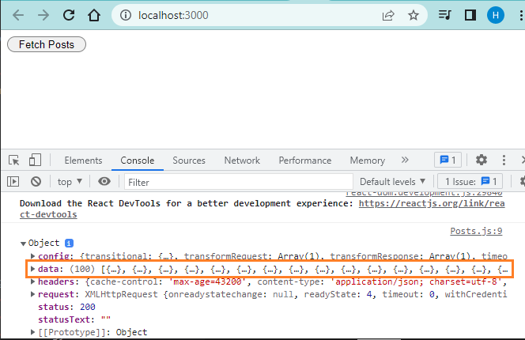
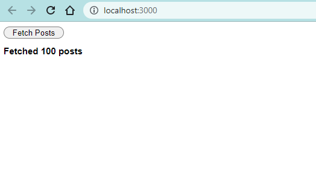
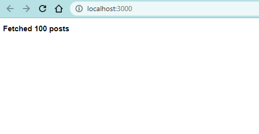

```toc

```

If your React app needs to fetch data from an API endpoint, then you have to make a HTTP request. In React apps we make HTTP requests using something called a HTTP client.

In this post, we will learn how to use a Promise based HTTP client called ~~axios~~.

> To make HTTP requests, you can also make use of the Fetch API built into most modern browsers.

### Using Axios

Install ~~axios~~ using ~~npm install axios~~ and import it at the top of your React project.

Now let’s use ~~axios~~ to make a GET request and fetch some posts from [JSON Placeholder](https://jsonplaceholder.typicode.com/), which is a free fake REST API service for testing and prototyping purposes. We will make the request to the ~~/posts~~ endpoint, which will return to us an array of 100 posts.

Understand that making a network request is an asynchronous operation. Therefore, it will take some amount of time for ~~axios~~ to reach out to the JSONPlaceholder API and fetch the response. So we will handle the Promise object returned from the execution of this asynchronous operation using ~~async...await~~.

###### Learn more about Promise and async/await in my blog post [here](https://hemanta.io/promise-and-async-await-in-javascript/).

```js:title=src/components/Posts.js {numberLines, 2-2, 5-10}
import React from "react";
import axios from "axios";

const Posts = () => {
  const fetchPosts = async () => {
    const response = await axios.get(
      "https://jsonplaceholder.typicode.com/posts"
    );
    console.dir(response);
  };
  return <button onClick={fetchPosts}>Fetch Posts</button>;
};

export default Posts;
```

When I click on the ~~FetchPosts~~ button, the response gets logged to the console.



We can see that the data we care about (posts) is the value of the ~~data~~ key inside the ~~request~~ object.

### Setting State After Async Requests

After we get the response back, we can set state in our React component.

```js:title=src/components/Posts.js {numberLines, 1-1, 5-5, 11-11}
import React, { useState } from "react";
import axios from "axios";

const Posts = () => {
  const [posts, setPosts] = useState([]);

  const fetchPosts = async () => {
    const { data } = await axios.get(
      "https://jsonplaceholder.typicode.com/posts"
    );
    setPosts(data);
  };
  return (
    <>
      <button onClick={fetchPosts}>Fetch Posts</button>
      <h2>
        Fetched {posts.length > 0 ? posts.length : 0} post
        {posts.length > 0 ? "s" : ""}
      </h2>
    </>
  );
};

export default Posts;
```



Now, let’s say we want to fetch posts (only once) when the ~~Posts~~ component renders. We don’t want to press any button to fetch posts.

Then, we will have to make the request inside ~~useEffect()~~.

###### Learn more about the ~~useEffect()~~ hook in my blog post [here](https://hemanta.io/fetching-data-from-an-api-in-react-components-using-the-useEffect-hook/).

```js:title=src/components/Posts.js {numberLines, 1-1, 7-15}
import React, { useState, useEffect } from "react";
import axios from "axios";

const Posts = () => {
  const [posts, setPosts] = useState([]);

  useEffect(() => {
    const fetchPosts = async () => {
      const { data } = await axios.get(
        "https://jsonplaceholder.typicode.com/posts"
      );
      setPosts(data);
    };
    fetchPosts();
  }, []);

  return (
    <h2>
      Fetched {posts.length > 0 ? posts.length : 0} post
      {posts.length > 0 ? "s" : ""}
    </h2>
  );
};

export default Posts;
```



### Creating Custom Clients

We can shorten the code we have written for making network requests using ~~axios~~ inside the ~~Posts~~ component by creating a custom client.

```js:title=src/api/FakeApi.js {numberLines}
import axios from "axios";

// Create a new instance of axios
export default axios.create({
  baseURL: "https://jsonplaceholder.typicode.com",
});
```

```js:title=”src/components/Posts.js” {numberLines, 2-2, 9-9}
import React, { useState, useEffect } from "react";
import fakeApi from "./api/FakeApi";

const Posts = () => {
  const [posts, setPosts] = useState([]);

  useEffect(() => {
    const fetchPosts = async () => {
      const { data } = await fakeApi.get("/posts");
      setPosts(data);
    };
    fetchPosts();
  }, []);

  return (
    <h2>
      Fetched {posts.length > 0 ? posts.length : 0} post
      {posts.length > 0 ? "s" : ""}
    </h2>
  );
};

export default Posts;
```
