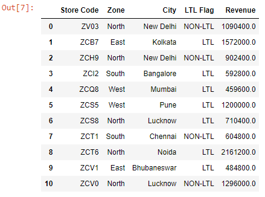

```toc

```

Let's read the ~~budget.xlsx~~ file into a DataFrame:

```py {numberLines}
import pandas as pd

data = pd.read_excel("budget.xlsx", sheet_name="sheet2")

data
```

**Output:**



### sum()

```py {numberLines}
data["Revenue"].sum()

11074400.0
```

### mean()

```py {numberLines}
data["Revenue"].mean()

1006763.6363636364
```

### count()

```py {numberLines}
data["Revenue"].count()

11
```

### max()

```py {numberLines}
data["Revenue"].max()

2161200.0
```

### min()

```py {numberLines}
data["Revenue"].min()

459600.0
```

### len

```py {numberLines}
len(data)

11
```

### describe()

```py {numberLines}
data["Revenue"].describe()

count    1.100000e+01
mean     1.006764e+06
std      5.276084e+05
min      4.596000e+05
25%      5.988000e+05
50%      9.024000e+05
75%      1.248000e+06
max      2.161200e+06
Name: Revenue, dtype: float64
```

```py {numberLines}

```
