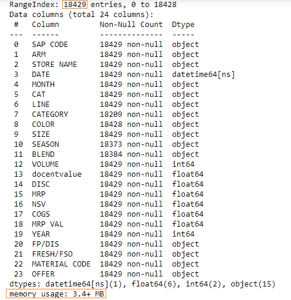
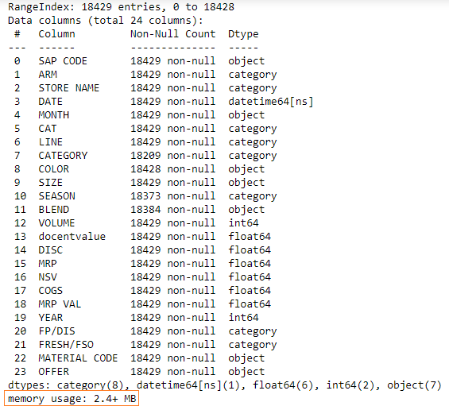

Let’s read an Excel file into a DataFrame:

```py {numberLines}
import pandas as pd

nsv = pd.read_excel("./NSV/PA/August/PA-AUGUST-19.xlsx", sheet_name = "Data")

nsv.info()
```

**Output:**



We have 18429 rows in our DataFrame and the memory usage is 3.4+ MB.

We can employ a method to optimize memory usage.

We will have to find the columns where there are a few unique values and then convert those columns to categorical data type.

The following columns have a few unique values:

- ARM
- LINE
- SEASON

We can check the unique values in a column using the ~~nunique()~~ method.

###### Learn how to count unique values in a column in my blog post [here](https://hemanta.io/count-the-unique-values-in-a-column-in-a-pandas-dataframe/).

```py {numberLines}
nsv["ARM"].nunique()
7

nsv["LINE"].nunique()
7

nsv["SEASON"].nunique()
14
```

Let’s convert these columns to categorical data types.

```py {numberLines}
nsv["ARM"] = nsv["ARM"].astype("category")

nsv["LINE"] = nsv["LINE"].astype("category")

nsv["SEASON"] = nsv["SEASON"].astype("category")
```

Let’s check the memory usage now:

```py {numberLines}
nsv.info()
```

**Output:**



The new memory usage is 2.4MB, which is a reduction of approximately 30%.
