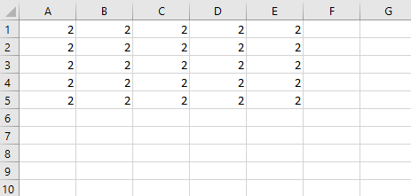

In Excel VBA, we can create an array that can have as many as 60 dimensions. However, we will focus only on creating 2-dimensional arrays.

The following example declares a 2-dimensional array.

```vb {bumberLines}
Dim MyArray (1 To 5, 1 To 5) As Integer
```

We can think of this array as occupying a 5 x 5 matrix.

We can refer to a specific element in this 2-dimensional array by specifying two index numbers: its row and its column in the matrix.

**Example:**

```vb {numberLines}
Sub ArrayDemo()

Dim numbers(1 To 5, 1 To 5) As Integer

Dim i As Integer
Dim j As Integer

For i = 1 To 5
    For j = 1 To 5
        numbers(i, j) = 2
    Next j
Next i

Range("A1:E5").Value = numbers

End Sub
```

**Output:**


