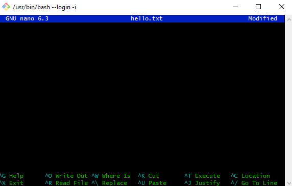
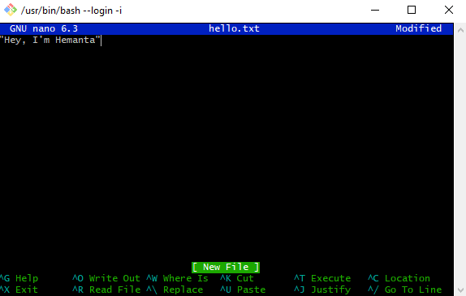
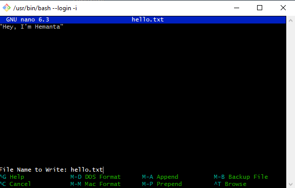

_nano_ is a command line text editor. It works the same way as a desktop text editor like Notepad, except it is accessible from the command line and only accepts keyboard input.

```sh
$ nano hello.txt
```

The command above will open a new text file named **hello.txt** in the nano text editor.



Let's enter the text string ~~"Hey, I'm Hemanta."~~ at the line indicated by the cursor.



If we want to save the **hello.txt** file, we press ~~ctrl + O~~. This will result in the nano text editor display a prompt asking us to confirm the name of the file.



Press ~~Enter~~. Then, we can exit the nano program using ~~ctrl + x~~.

Now, we can see the contents of the file using the command ~~cat hello.txt~~.
