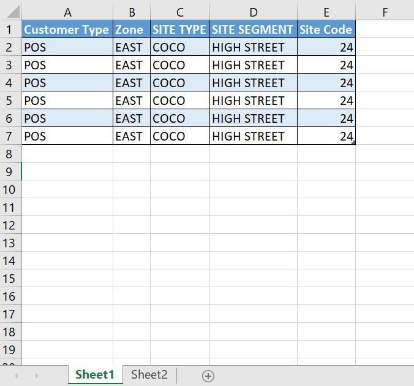
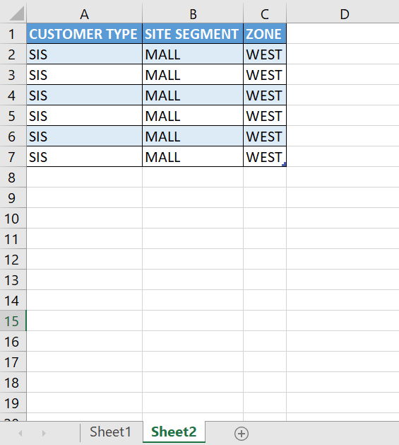
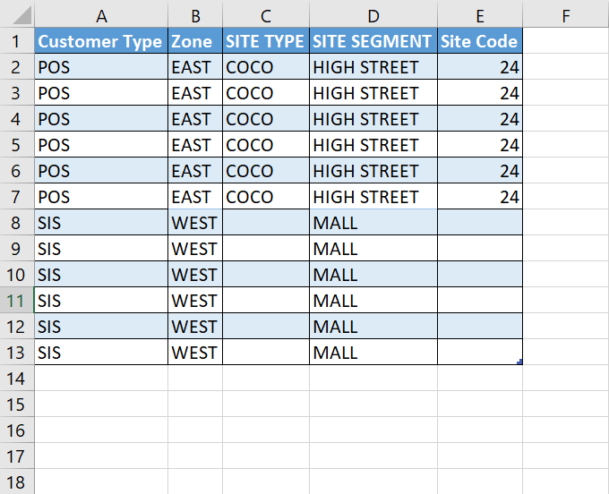

Below, we have two different datasets in two differen worksheets in a single Excel workbook.





We can combine both the datasets into a single dataset using the _Sub_ procedure below:

```vb {numberLines}
Sub Worksheet_Combine()

Dim i As Long
Dim j As Long
Dim lastColumnFirstDataset As Long
Dim firstColumnSecondDataset As Long
Dim ws1 As Worksheet
Dim ws2 As Worksheet

lastColumnFirstDataset = ws1.Cells(1, 1).End(xlToRight).column
firstColumnSecondDataset = ws2.Cells(1, 1).column
lastColumnSecondDataset = ws2.Cells(1, 1).End(xlToRight).column

Set ws1 = ActiveWorkbook.Worksheets("Sheet1")
Set ws2 = ActiveWorkbook.Worksheets("Sheet2")

For i = 1 To lastColumnFirstDataset

    For j = firstColumnSecondDataset To lastColumnSecondDataset
            If LCase(ws1.Cells(1, i)) = LCase(ws2.Cells(1, j)) Then
                Range(ws2.Cells(1, j).Offset(1, 0), ws2.Cells(1, j).Offset(1, 0).End(xlDown)).Copy _
                ws1.Cells(1, i).End(xlDown).Offset(1, 0)
            End If
    Next j

Next i

End Sub
```

In the code snippet above, the outer _For_ loop is using the ~~i~~ counter variable to loop through the first row in the ~~Sheet1~~ worksheet. The inner _For_ loop is using the ~~j~~ counter variable to loop through the first row in the ~~Sheet2~~ worksheet.

Each time through the ~~i~~ loop, the code runs through the ~~j~~ loop multiple times.

Executing the ~~Worksheet_Combine~~ _Sub_ procedure above gives us the following output:


