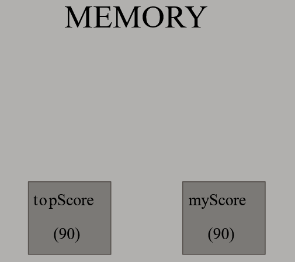
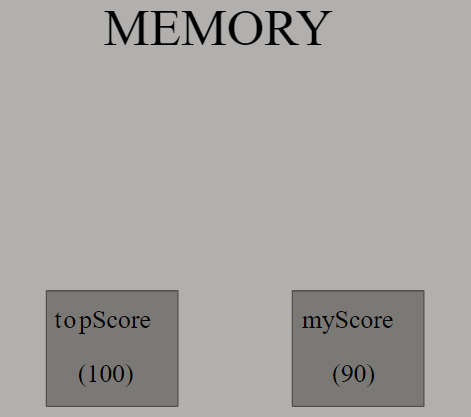
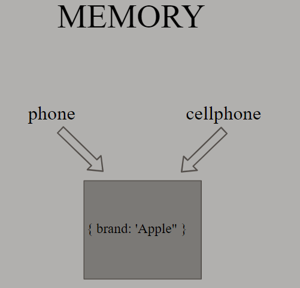
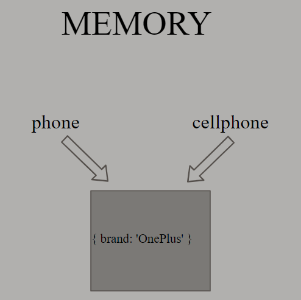
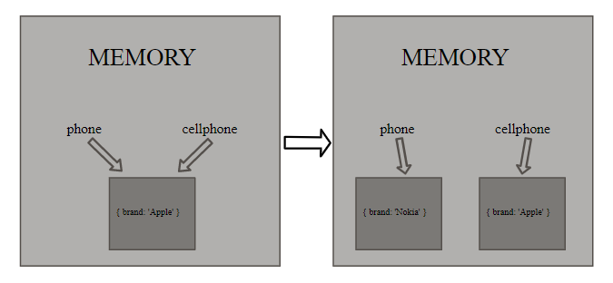

We know that JavaScript has six primitive data types: ~~string~~, ~~number~~, ~~boolean~~, ~~undefined~~, ~~null~~ and ~~symbol~~. A primitive is data that is not an object and has no methods.

We also know that in JavaScript, except the primitive data types, everything is an object. An Object is an object. An array is an object. A function is an object and so on.

To understand some of the key differences between objects and primitives, let’s start with an example:

```js {numberLines}
let topScore = 90
let myScore = topScore
```

On line 1, when ~~topScore~~ variable is created JavaScript engine creates a new space in memory and saves the value of ~~topScore~~ as 90. On line 2, we have a different variable called ~~myScore~~ whose value is equal to the value of the ~~topScore~~ variable. In this case, JavaScript creates a different space in memory and copies the value of the topScore variable. As a result, we have two different spaces in memory and both the variables have the same value.



```js
topScore = 100

console.log(topScore) // 100

console.log(myScore) // 90
```

Now if we assign the ~~topScore~~ variable a different value, the value of ~~myScore~~ variable doesn't change because ~~myScore~~ variable points to a different space in memory than the ~~topScore~~ variable.



When we deal with objects, something different happens though. Consider the following example:

```js {numberLines}
let phone = {
  brand: "Apple",
}

let cellphone = phone
```

On line 1, we have defined an object, during the creation of which JavaScript engine creates new space in memory. On line 5, the value of the ~~cellphone~~ variable is equal to the value of the ~~phone~~ variable. In this case, unlike primitives, Javascript engine doesn't create new space for the ~~cellphone~~ variable. In other words, the ~~cellphone~~ variable doesn't copy the value of the ~~phone~~ variable. Both the variables - ~~phone~~ and ~~cellphone~~ - become references for the same object in memory.



Let's assign the ~~brand~~ property a new value using the dot operator.

```js {numberLines}
phone.brand = "OnePlus"

console.log(phone.brand) // OnePlus

console.log(cellphone.brand) // OnePlus
```

Now, if we check the value of the ~~brand~~ property of both the ~~phone~~ and ~~cellphone~~ variables, we get the same result - ~~OnePlus~~ - in both the cases.



```js {numberLines}
let phone = {
  brand: "Apple",
}
let cellphone = phone
phone = {
  brand: "Nokia",
}
console.log(phone.brand) // Nokia

console.log(cellphone.brand) // Apple
```

However, if we assign the ~~phone~~ variable a new object using the equal (~~=~~) sign (line 5), then JavaScript will create new space in memory. And if we log the value of the ~~brand~~ property of both the ~~phone~~ and ~~cellphone~~ variables, we get different results as shown below:


