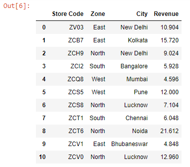
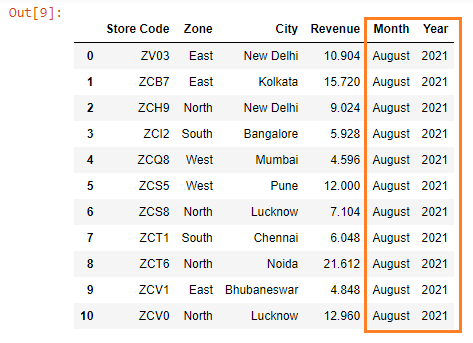

In pandas, we can add multiple new columns at once to a dataframe using the ~~assign()~~ method.

Let’s read an Excel worksheet into a pandas dataframe:

```py {numberLines}
import pandas as pd

data = pd.read_excel("budget.xlsx")

data
```

**Output:**



Let’s add two new columns - ~~Month~~ & ~~Year~~ - to the dataframe above.

The arguments we pass to the ~~assign()~~ method are the names of the columns we want to create (or overwrite) and the values are the data for the columns.

> **Note:** ~~assign()~~ does not change our original dataFrame; instead, it creates a new **DataFrame** object with the columns added.

```py {numberLines}
data = data.assign(Month='August', Year=2021)

data
```

**Output:**


