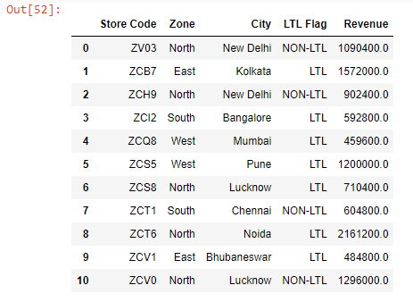
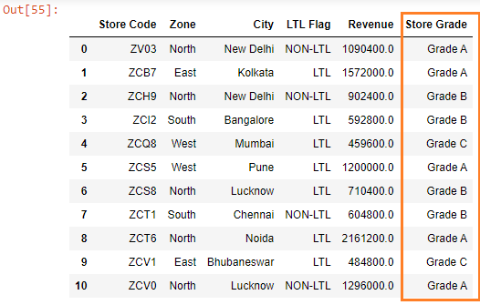

Let’s read the ~~budget.xlsx~~ file into a DataFrame:

```py {numberLines}
import pandas as pd

budget = pd.read_excel("budget.xlsx")

budget
```

**Output:**



Let's say we want to grade different stores based on their revenue.

First, we will write a function that contains the grading logic:

```py {numberLines}
def grade(num):
    if num > 1000000:
        return "Grade A"
    elif num > 500000 and num < 1000000:
        return "Grade B"
    else:
        return "Grade C"
```

Next, we will pass the ~~grade~~ function to the ~~apply()~~ method, which we will call on the ~~Revenue~~ column.

```py {numberLines}
budget["Store Grade"] = budget1["Revenue"].apply(grade)

budget
```

**Output:**


