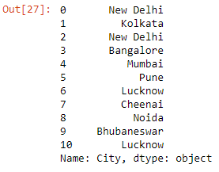

```toc

```

Let's read the ~~budget.xlsx~~ workbook into a DataFrame:

```py {numberLines}
import pandas as pd

data = pd.read_excel("budget.xlsx")

data
```

**Output:**


### upper()

- **Series.str.upper:** Converts all characters to uppercase.

```py {numberLines}
data["Zone"].str.upper()
```

**Output:**


### lower()

- **Series.str.lower:** Converts all characters to lowercase.

```py {numberLines}
data["Store Code"].str.lower()
```

**Output:**


### title()

- **Series.str.title:** Converts the first character of each word to uppercase and remaining to lowercase.

```py {numberLines}
data["City"].str.title()
```

**Output:**



### len()

- **Series.str.len:** Returns the length of each element in the Series.

```py {numberLines}
data["City"].str.len()
```


### replace()

We will replace the character ~~D~~ in all the elements in the ~~Store Code~~ column with the character ~~D~~.

```py {numberLines}
data["Store Code"].str.replace("Z", "D")
```

**Output:**


