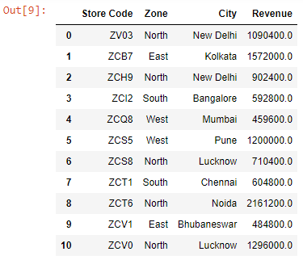

Let’s read the ~~budget.xlsx~~ file into a DataFrame:

```py {numberLines}
import pandas as pd

data = pd.read_excel("budget.xlsx", sheet_name="sheet2")

data
```

**Output:**


We can delete the ~~LTL Flag~~ column using the ~~del~~ keyword as shown below:

```py {numberLines}
del data["LTL Flag"]

data
```

**Output:**

