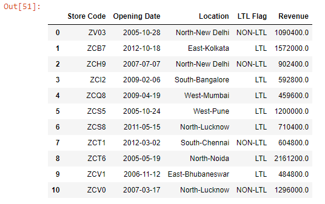
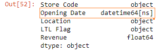
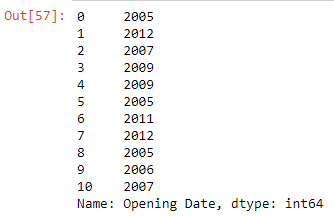
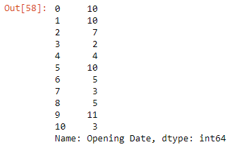
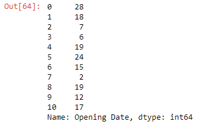
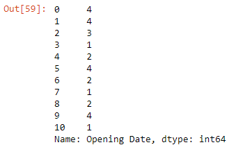

Let’s read the ~~budget.xlsx~~ file into a DataFrame:

```py {numberLines}
import pandas as pd

data = pd.read_excel("budget.xlsx", parse_dates=["Opening Date"])

data
```

**Output:**



Let;s return the data type of each column using ~~dtypes~~:

```py {numberLines}
data.dtypes
```

**Output:**



The ~~Opening Date~~ column contains ~~datetime~~ objects.

We can extract various parts from the date - year, month, date & quarter - using Pandas ~~dt~~, which is the accessor object to the datetime properties of a Pandas Series.

> Note that the ~~dt~~ accessor object works only with ~~datetime~~ data types.

```py {numberLines}
data["Opening Date"].dt.year
```

**Output:**



```py {numberLines}
data["Opening Date"].dt.month
```

**Output:**



```py {numberLines}
data["Opening Date"].dt.day
```

**Output:**



```py {numberLines}
data["Opening Date"].dt.quarter
```

**Output:**


