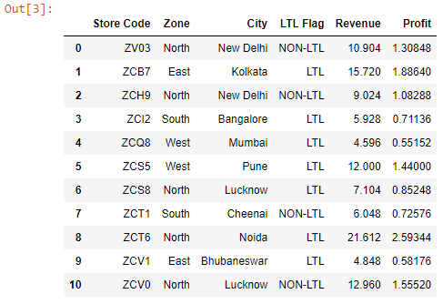
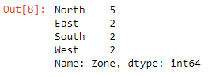
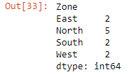
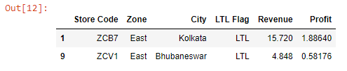
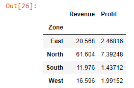
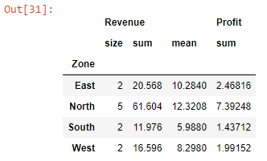

```toc

```

We can use the ~~groupby~~ method to split a DataFrame into multiple groups/segments based on the unique values in a particular column.

This concept is best illustrated with the help of an example. So, let’s read the ~~budget.xlsx~~ file into a DataFrame:

```py {numberLines}
import pandas as pd

data = pd.read_excel("budget.xlsx")

data
```

**Output:**



Let’s say we want to create multiple segments of our dataset based on the unique values in the ~~Zone~~ column. (_You can also choose to segment the dataset based on the ~~LTL Flag~~ or the ~~City~~ column. The decision really depends on your requirements._)

We can check the unique values and their counts in the ~~Zone~~ column using the ~~value_counts()~~ method.

```py {numberLines}
data["Zone"].value_counts()
```

**Output:**



We have four unique values: ~~East~~, ~~West~~, ~~North~~, ~~South~~. Next, we will create our zone segments using the ~~groupby~~ method.

```py {numberLines}
zones = data.groupby("Zone")

zones

<pandas.core.groupby.generic.DataFrameGroupBy object at 0x000001AC01D6D4F0>
```

Calling the ~~grouby~~ method on the ~~data~~ DataFrame object creates a ~~DataFrameGroupBy~~ object.

### size()

We can get the no. of segments the ~~grouby()~~ method has created using the ~~size()~~ method.

```py {numberLines}
zones.size()
```

**Output:**



We can see that there are 4 unique segments (~~East~~, ~~West~~, ~~North~~, ~~South~~) that correspond to each unique value in the ~~Zone~~ column.

### groups()

We can see the segments we have created using the ~~groups()~~ method.

```py {numberLines}
zones.groups()

{'East': [1, 9], 'North': [0, 2, 6, 8, 10], 'South': [3, 7], 'West': [4, 5]}
```

Calling the ~~groups~~ method on the ~~zones~~ DataFrameGroupBy object will get us a python dictionary. The keys in the dictionary represent each created segment and the values represent all of the rows that fall under that segment.

### get_group()

We can retrieve a segment from our ~~zones~~ DataFrameGroupBy object using the ~~get_group()~~ method, which receives the name of the segment as its argument.

```py {numberLines}
east = zones.get_group("East")

east
```

This will pull out all of the rows where the value in the ~~Zone~~ column is ~~East~~.

**Output:**



### sum()

```py {numberLines}
zones.sum()
```

This will give us the sum of all the columns (_with numerical values_) in our DataFrame.

**Output:**



### agg()

We call the ~~agg()~~ method directly on the ~~zones~~ DataFrameGroupBy object.

```py {numberLines}
zones.agg({"Revenue" : ["size", "sum", "mean"], "Profit" :"sum"})
```

We can perform different aggregations in different columns.

**Output:**


