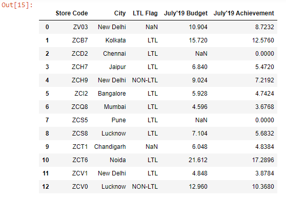
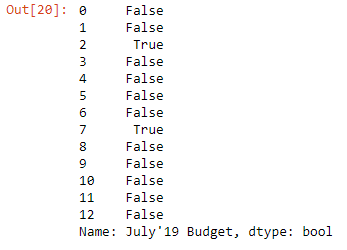
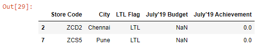
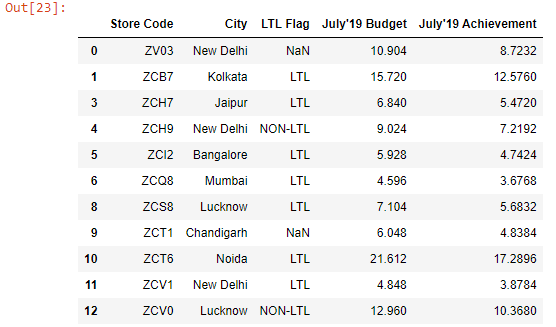

First, let’s read an Excel file into a DataFrame.

```py {numberLines}
import pandas as pd

budget = pd.read_excel("budget.xlsx")

budget
```

**Output:**



Let’s say we want to return the rows where the values in the ~~July’19 Budget~~ column are null.

We can do so using the ~~isnull()~~ method.

```py {numberLines}
condition1 = budget["July'19 Budget"].isnull()

condition1
```

**Output:**



The method returns a boolean Series.

Then we extract the rows by passing the ~~condition~~ variable inside the square brackets.

```py {numberLines}
budget[condition1]
```

**Output:**



There is a complementary method called ~~notnull()~~ that returns the non-null values.

```py {numberLines}
condition2 = budget["July'19 Budget"].notnull()

budget[condition2]
```


