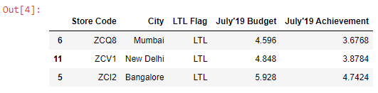

```toc

```

### nlargest()

Let’s read the ~~budget.xlsx~~ workbook into a DataFrame:

```py {numberLines}
import pandas as pd

budget = pd.read_excel("budget.xlsx")

budget
```

**Output:**


Our DataFrame has duplicate rows. We will remove them using the ~~drop_duplicates()~~ method.

```py {numberLines}
budget.drop_duplicates(inplace=True)
```

Let’s say we want to find out the top 3 stores with the highest July’19 budget.

We can do so using the ~~nlargest()~~ method, which returns the first ~~n~~ rows ordered by ~~columns~~ in descending order.

The first argument that we pass to the method is the no. of rows we want to extract. The second argument is the name of the column to order by.

```py {numberLines}
budget.nlargest(3, columns="July'19 Budget")
```

**Output:**


### nsmallest()

Returns the first ~~n~~ rows ordered by columns in ascending order.

~~nsmallest()~~ is the complementary method to ~~nlargest()~~.

In the following code example, we find out the bottom 3 stores with the lowest July’19 budget.

```py {numberLines}
budget.nsmallest(3, columns="July'19 Budget")
```

**Output:**


