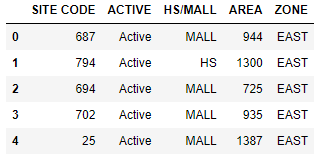
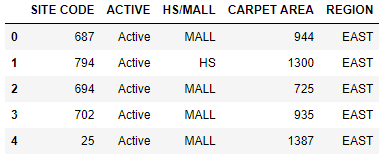

We can rename individual columns by using the ~~.rename~~ method.

Pass a dictionary like the one below to the ~~columns~~ keyword argument.

```sh {numberLines}
{"Old Column Name1" : "New Column Name1", "Old Column Name2" : "New Column Name2"}
```

Below, we have an Excel table:



Let’s rename ~~AREA~~ to ~~CARPET AREA~~ and ~~ZONE~~ to ~~REGION~~.

```py {numberLines}
sales.rename(columns={"AREA" : "CARPET AREA", "ZONE" : "REGION"}, inplace=True)
```

**Output:**



> Note that using ~~rename~~ with only the ~~columns~~ keyword will create a new DataFrame, leaving your original DataFrame unchanged. That’s why we also passed in the keyword argument ~~inplace = True~~. Using ~~inplace = True~~ lets us edit the original DataFrame.
