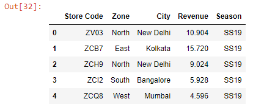
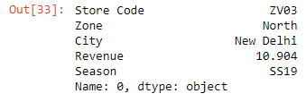
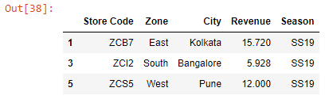
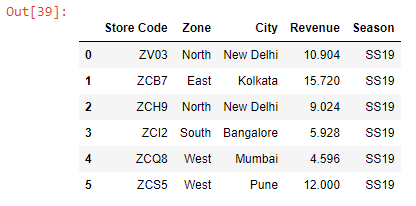
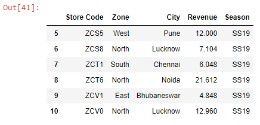

Let’s first read an Excel workbook into a DataFrame:

```py {numberLines}
import pandas as pd

data = pd.read_excel('budget.xlsx')

data.head()
```

**Output:**



Note that we have a numeric index.

We can retrieve a single row by passing the index of the row inside the square brackets.

```py {numberLines}
data.loc[0]
```

**Output:**



As we can see, when we retrieve a single row, we get the result as a Series.

We can retrieve non-sequential rows by passing a list of their index numbers inside the square brackets.

```py {numberLines}
data.loc[[1, 3, 5]]
```

**Output:**



We can retrieve a subset of rows using the slicing technique.

The slicing syntax is ~~[start:end]~~, where **both the start and the end are inclusive**, unlike in Python where the start is inclusive but the end is exclusive.

```py {numberLines}
data.loc[:5]
```

**Output:**



```py {numberLines}
data.loc[5:]
```

**Output:**


