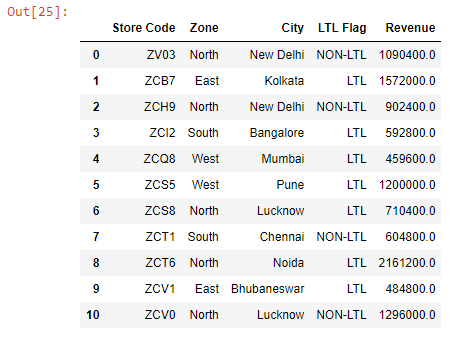
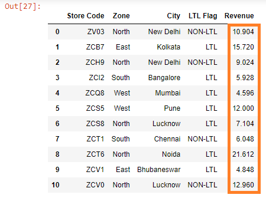

We can apply an operation to every value in a pandas Series using a feature called broadcasting.

Let’s read the ~~budget.xlsx~~ file into a DataFrame:

```py {numberLines}
import pandas as pd

data = pd.read_excel("budget.xlsx")

data
```

**Output:**



For example, if we wanted to divide every value in the ~~Revenue~~ column with 100000, we can do so using the ~~/=~~ operator.

```py {numberLines}
data["Revenue"] /= 100000

data
```

**Output:**



Similarly, we can add, subtract and multiply using the ~~+=~~, ~~-=~~ & ~~\*=~~ operators respectively.
