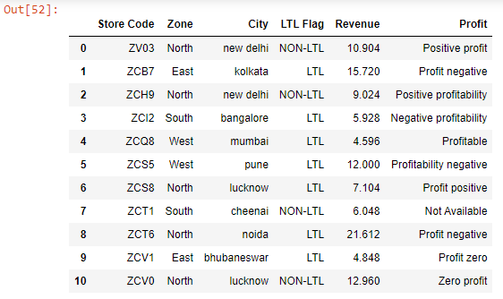
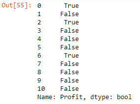
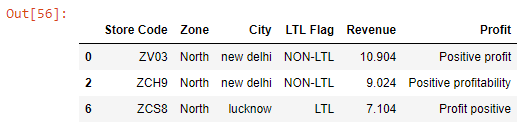

We can test whether string elements of a Series contain a substring using the ~~contains()~~ method.

The ~~contains()~~ method returns a boolean Series.

Let’s read the ~~budget.xlsx~~ file into a DataFrame:

```py {numberLines}
data = pd.read_excel("budget.xlsx")

data
```

**Output:**



We want to return all the rows where the string elements in the ~~Profit~~ column contain the string ~~positive~~.

> Note that the substring ~~positive~~ that we are trying to search for in the ~~Profit~~ column might be in different cases. So, we will convert them to lowercase before applying the ~~contains()~~ method.

```py {numberLines}
condition = data["Profit"].str.lower().str.contains("positive")

condition
```

The ~~contains()~~ method returns a boolean Series.

**Output:**



Next, we pass the ~~condition~~ variable inside square brackets to return the required rows.

```py {numberLines}
data[condition]
```

**Output:**


