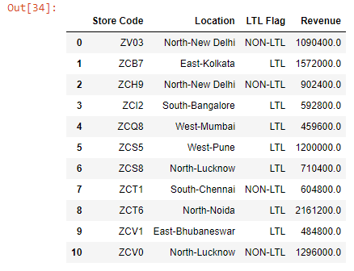
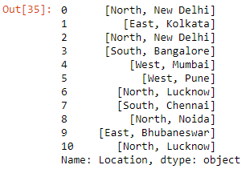
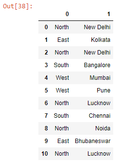
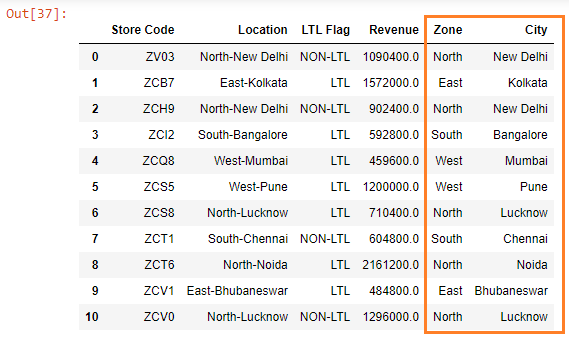

Let’s read the ~~budget.xlsx~~ file into a DataFrame:

```py {numberLines}
import pandas as pd

data = pd.read_excel("budget.xlsx")

data
```

**Output:**



The values in the ~~Location~~ column are made up of the zone and the city that a particular store is located at.

Let’s say we want to split the values in the ~~Location~~ column into two parts. We can do so using the ~~Series.str.split()~~ method.

Note that the words are divided by a dash(~~-~~), which is the delimiter around which we will split the values.

```py {numberLines}
data["Location"].str.split("-")
```

**Output:**



We can expand the split strings into different columns by passing ~~expand=True~~ to the ~~split()~~ method. This will return a DataFrame with 2 columns.

```py {numberLines}
data["Location"].str.split("-", expand=True)
```

**Output:**



Next, if we want to create 2 new columns - ~~Zone~~ and ~~City~~ - and assign them the columns of the newly Created DataFrame, we can do so using the following code snippet:

```py {numberLines}
data["Zone"] = data["Location"].str.split("-").str.get(0)

data["City"] = data["Location"].str.split("-").str.get(1)

data
```

The ~~.str.get(0)~~ method extracts the column located at position 0 and ~~.str.get(1)~~ extracts the column located at position 1.

**Output:**


