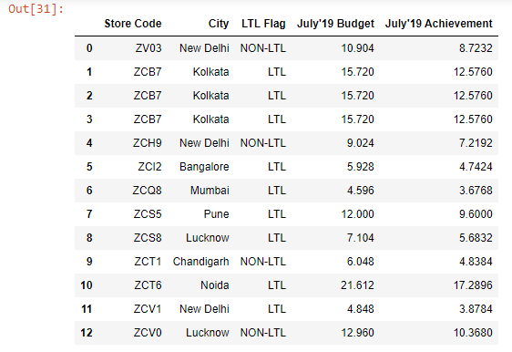
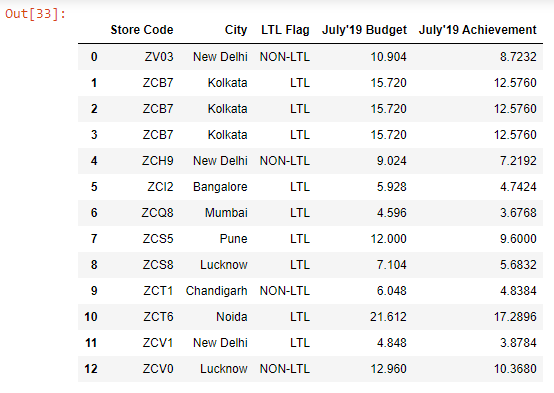

```toc

```

### set_index()

Let’s read the ~~budget.xlsx~~ file into a DataFrame:

```py {numberLines}
import pandas as pd

budget = pd.read_excel("budget.xlsx")

budget
```

**Output:**



Let’s say we want the ~~Store Code~~ column to serve as the index of our DataFrame. We can achieve this using the ~~set_index()~~ method:

```py {numberLines}
budget.set_index(keys="Store Code", inplace=True)

budget
```

**Output:**


As we can see above, the ~~Store Code~~ column is no longer a regular column in our DataFrame - it has become the new index.

### reset_index()

There is a complementary method called ~~reset_index()~~, which moves the current index back into a column position and creates a brand new numeric pandas index.

```py {numberLines}
budget.reset_index()
```

**Output:**


