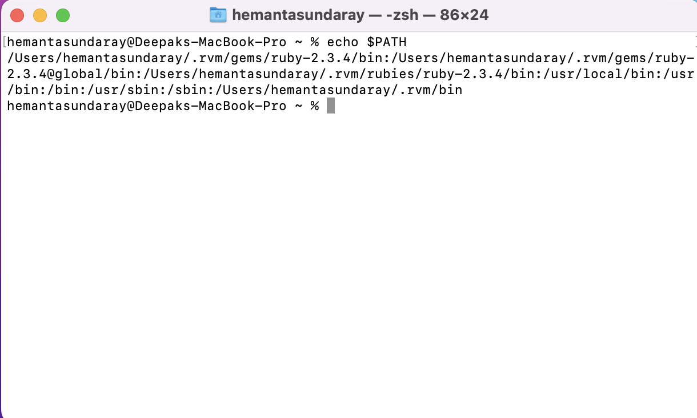

~~PATH~~ is an environment variable that stores a list of directories separated by a colon.

Type ~~echo $PATH~~ in the terminal and you should see a list of directories.

Each directory contains scripts for the command line to execute. The ~~PATH~~ variable simply lists the directories that contain scripts.
