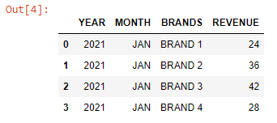

First, we will read an Excel file as a Pandas DataFrame:

```py {numberLines}
import pandas as pd
data = pd.read_excel("BRAND REVENUE.xlsx")
data
```

**Output:**


We can create a bar chart using the code below:

```py {numberLines, 6-6, 8-8, 10-10, 16-19}
import matplotlib.pyplot as plt

brands = data["BRANDS"]
revenue = data["REVENUE"]

plot = plt.bar(brands, revenue)

plt.xticks(brands, rotation=20)

plt.subplots_adjust(top=1.5)

plt.xlabel("Brands")
plt.ylabel("Revenue")
plt.title("BRAND REVENUE - JAN-21")

for rect in plot:
    height = rect.get_height()
    plt.text(rect.get_x() + rect.get_width()/2, 1.002*height,'%d' %
    int(height), ha='center', va='bottom')
```

Executing the code block above results in the following bar chart:


And here is the explanation of the code block that created the bar chart:

**LINE-6:** We have created the bar chart using the ~~.plt.bar()~~ function with two arguments:

- x-values: A list of x-positions for each bar
- y-values: A list of heights for each bar

**LINE 8:** We have used the ~~rotation~~ keyword to rotate our x labels by 20 degrees.

**LINE 10:** We have used the ~~plt.subplots_adjust()~~ command with the ~~top~~ keyword argument to add space to the top of the graph.

**LINE 16-19:** ~~plt.text()~~ within the ~~for~~ loop annotates each bar with its corresponding data value. The first two arguments specify where exactly that data text has to be placed over the bar. Then, the arguments ~~va~~ and ~~ha~~ align the text centrally over the bar.
