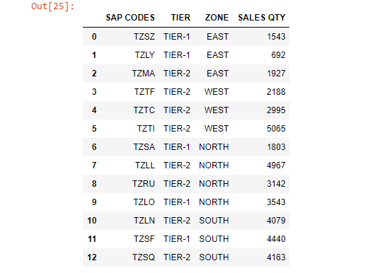
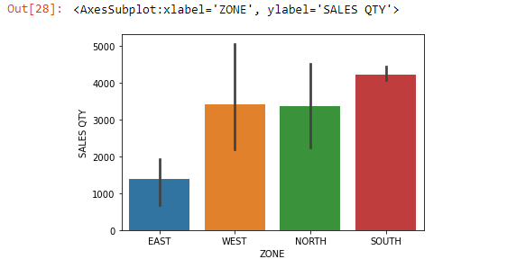
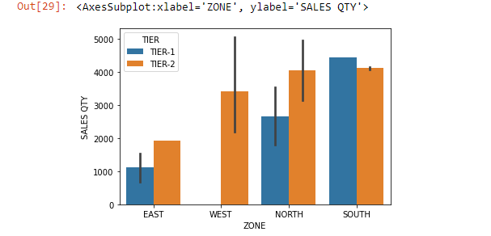
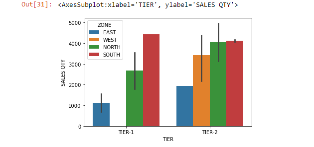

Using Seaborn, we can plot a bar using the ~~sns.barplot()~~ command.

The ~~sns.barplot()~~ function takes at least three keyword arguments:

- **data**: a Pandas DataFrame that contains the data
- **x**: a string that tells Seaborn which column in the DataFrame contains x-labels.
- **y**: a string that tells Seaborn which column in the DataFrame contains the heights we want to plot for each bar.

```py {numberLines}
import pandas as pd
import seaborn as sns
```

```py {numberLines}
sales = pd.read_excel("Seaborn.xlsx")

sales
```



```py {numberLines}
sns.barplot(data=sales, x=sales["ZONE"], y=sales["SALES QTY"])
```



By default, Seaborn will place error bars on each bar. Error bars are the small lines that extend above and below the top of each bar. Error bars visually indicate the range of values that might be expected for that bar.

###### Learn how to communicate uncertainty in bar charts using error bars in my blog post [here](https://hemanta.io/bar-chart-with-error-bars/)

There are several different calculations that are commonly used to determine error bars. By default, Seaborn uses something called a _**bootstrapped confidence interval**_. Roughly speaking, this interval means that “based on this data, 95% of similar situations would have an outcome within this range”.

> **NOTE:** By default, Seaborn will aggregate and plot the _mean_ of each category. However, Seaborn is flexible and can calculate any aggregate statistic you want. To do so, you’ll need to use the keyword argument ~~estimator~~, which accepts any function that works on a list. For example, to calculate the median you can pass in ~~np.median~~ to the ~~estimator~~ keyword.

Sometimes you will want to aggregate your data by multiple columns to visualise nested categorical variables.

For example, we can compare both ~~ZONE~~ & ~~TIER~~ factors at once using the keyword ~~hue~~, which adds a nested categorical variable to the plot.

```py {numberLines}
sns.barplot(data=sales, x=sales["ZONE"], y=sales["SALES QTY"], hue=sales["TIER"])
```



```py {numberLines}
sns.barplot(data=sales, x=sales["TIER"], y=sales["SALES QTY"], hue=sales["ZONE"])
```


