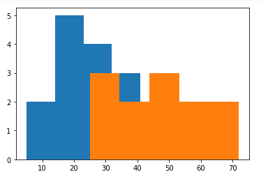

We can get a feel for a large dataset using histograms, which help us see the shape of a dataset – whether values are close together or skewed to one side.

Histograms tell us how many values in a dataset fall between different sets of numbers. They categorize data by breaking them into bins, where each bin contains a subset of the data range.

All bins in a histogram are always the same size. The width of each bin is the distance between the minimum and maximum values of each bin. Each bin is represented by a different rectangle whose height is the number of elements from the dataset that fall within that bin.

To make a histogram in Matplotlib, we use the command ~~plt.hist~~.

```py {numberLines}
import matplotlib as mpl
import matplotlib.pyplot as plt
# set the interactive mode ON
plt.ion()

datasetOne = [5, 12, 14, 16, 18, 20, 22, 24, 26, 28, 30, 32, 34, 36, 50]
plt.hist(datasetOne, bins=5)
```


We use the keyword ~~bins~~ to set how many bins we want to divide the data into.

### Multiple Histograms

If we want to compare two different distributions, we can put multiple histograms on the same plot. However, it can be hard to read two histograms on top of each other.

For example, in this histogram, we can’t see all of the blue plot, because it’s covered by the orange one:

```py {numberLines}
datasetOne = [5, 12, 14, 16, 18, 20, 22, 24, 26, 28, 30, 32, 34, 36, 50]
datasetTwo = [28, 25, 32, 36, 56, 42, 44, 50, 48, 62, 68, 72]

plt.hist(datasetOne, bins=5)
plt.hist(datasetTwo, bins=5)
```



We have two ways we can solve a problem like this:

- Use the keyword ~~alpha~~, which can be a value between 0 and 1. This sets the transparency of the histogram. A value of 0 would make the bars entirely transparent. A value of 1 would make the bars completely opaque.

```py {numberLines}
datasetOne = [5, 12, 14, 16, 18, 20, 22, 24, 26, 28, 30, 32, 34, 36, 50]
datasetTwo = [28, 25, 32, 36, 56, 42, 44, 50, 48, 62, 68, 72]

plt.hist(datasetOne, bins=5, alpha=0.5)
plt.hist(datasetTwo, bins=5, alpha=0.5)
```

This would make both histograms visible on the plot:


- Use the keyword ~~histtype~~ with the argument ~~'step'~~ to draw just the outline of a histogram:

```py {numberLines}
datasetOne = [5, 12, 14, 16, 18, 20, 22, 24, 26, 28, 30, 32, 34, 36, 50]
datasetTwo = [28, 25, 32, 36, 56, 42, 44, 50, 48, 62, 68, 72]

plt.hist(datasetOne, bins=5, histtype='step')
plt.hist(datasetTwo, bins=5, histtype='step')
```

which results in a chart like:


