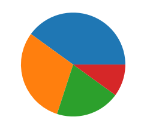
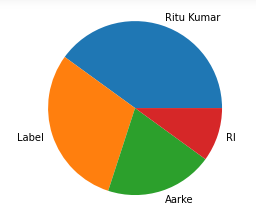
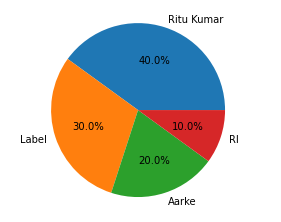

We use a pie chart when we want to display elements of a data set as proportions of a whole.

In Matplotlib, we can make a pie chart with the command ~~plt.pie~~, passing in the values we want to chart:

```py {numberLines, 7-7}
import matplotlib.pyplot as plt

brand_contribution = [40, 30, 20, 10]

brands=['Ritu Kumar', 'Label', 'Aarke', 'RI']

plt.pie(brand_contribution)
```

**Output:**



### Pie Chart Labeling

We also want to be able to understand what each slice of the pie represents. To do this, we can put labels on the chart itself:

```py {numberLines, 7-7}
import matplotlib.pyplot as plt

brand_contribution = [40, 30, 20, 10]

brands=['Ritu Kumar', 'Label', 'Aarke', 'RI']

plt.pie(brand_contribution, labels=brands)
```

This puts the category names into labels next to each corresponding slice:



One other useful labelling tool for pie charts is adding the percentage of the total that each slice occupies. Matplotlib can add this automatically with the keyword ~~autopct~~. We pass in string formatting instructions to format the labels how we want. Some common formats are:

- **'%0.2f'** — 2 decimal places, like 4.08
- **'%0.2f%%'** — 2 decimal places, but with a percent sign at the end, like 4.08%. You need two consecutive percent signs because the first one acts as an escape character, so that the second one gets displayed on the chart.
- **'%d%%'** — rounded to the nearest _int_ and with a percent sign at the end, like 4%.
  So, a full call to ~~plt.pie~~ might look like:

```py {numberLines, 7-7}
import matplotlib.pyplot as plt

brand_contribution = [40, 30, 20, 10]

brands=['Ritu Kumar', 'Label', 'Aarke', 'RI']

plt.pie(brand_contribution, labels=brands, autopct='%0.1f%%')
```

and the resulting chart would look like:


