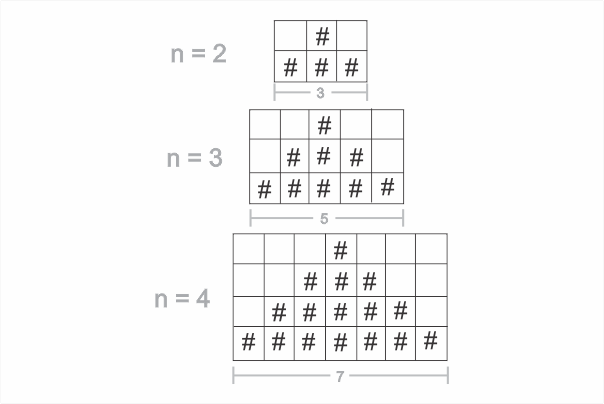

### Problem Statement

Write a function that accepts a positive number ~~n~~ and console logs a pyramid shape using the ~~#~~ character. The number of levels in the pyramid should be equal to the number ~~n~~.

Also, ensure that the pyramid has spaces on the left and right hand sides.

#### Examples:

```js {numberLines}
pyramid(2)

// ' # '
// '###'

pyramid(3)

// '  #  '
// ' ### '
// '#####'
```

This problem is an extension of the staircase problem, which you can read about in my blog post [here](https://hemanta.io/printing-a-staircase-pattern-in-javascript/).

### Solution

The following solution uses nested for loops.

```js {numberLines, 7-8}
const pyramid = n => {
  const midpoint = Math.floor((2 * n - 1) / 2)

  for (let row = 0; row < n; row++) {
    let level = ""

    for (let column = 0; column < 2 * n - 1; column++) {
      if (midpoint - row <= column && midpoint + row >= column) {
        level += "#"
      } else {
        level += " "
      }
    }

    console.log(level)
  }
}

pyramid(3)
//  #
// ###
//#####
```

In the code snippet above, you might think, how did I find out that the no. of columns is equal to ~~2\*n -1~~?

This will be clear with the following diagram. When we divide the pyramid into rows and columns, it becomes easier to calculate the relationship between the rows and the columns.



The logic for whether we should add a ~~#~~ character or an empty string to ~~level~~ is on line 8. You should be able to figure this out on your own.
