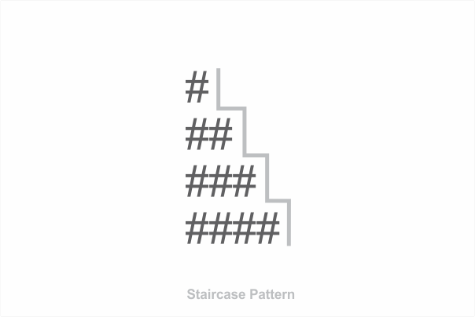

### Problem statement

Write a function that takes in a positive number ~~N~~ and console logs a staircase pattern using the ~~#~~ character. The number of steps in the staircase should be equal to ~~N~~.

Also, ensure that the step has spaces on the right hand side. The following examples should make the problem statement clear.

#### Example:

```js {numberLines}
steps(2)
//    '# '
//    '##'

steps(3)
//    '#  '
//    '## '
//    '###'

steps(4)
//    '#   '
//    '##  '
//    '### '
//    '####'
```

### Solution

To solve the staircase problem, we will use nested for loops: one for loop inside of another.

```js {numberLines}
const steps = n => {
  for (let row = 0; row < n; row++) {
    let stairs = ""

    for (let column = 0; column < n; column++) {
      if (column <= row) {
        stairs += "#"
      } else {
        stairs += " "
      }
    }

    console.log(stairs)
  }
}

steps(4)
// #
// ##
// ###
// ####
```

###### Find out more about for loops in JavaScript in my blog post [here](https://hemanta.io/for-loops-in-javascript/)
