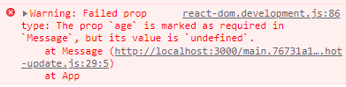
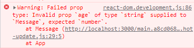

We have a component below named ~~Message~~. It expects to get passed two props: ~~name~~ & ~~age~~.

```js {numberLines}
import React from "react"

const Message = ({ name, age }) => {
  return <div>{`My name is ${name} and I am ${age} years old.`}</div>
}

const App = () => {
  return <Message name="Bob" age={34} />
}

export default App
```

Let’s say we want to do the following prop validation:

- We want to make sure that the ~~Message~~ component receives the right type of prop. We want the ~~name~~ prop to be of type _string_ and the ~~age~~ prop to be of type _number_.
- And we want both the props to be passed in to the ~~Message~~ component.

We can do the prop validation using an important React feature called ~~propTypes~~.

In order to start using ~~propTypes~~, we need to install and import the ~~prop-types~~ library.

Then we can declare ~~propTypes~~ as a property of the component after the component has been defined. Here is how it looks like:

```js {numberLines, 2-2, 8-11}
import React from "react"
import PropTypes from "prop-types"

const Message = ({ name, age }) => {
  return <div>{`My name is ${name} and I am ${age} years old.`}</div>
}

Message.propTypes = {
  name: PropTypes.string.isRequired,
  age: PropTypes.number.isRequired,
}

const App = () => {
  return <Message name="Bob" age={34} />
}

export default App
```

On line 8-11, notice that the value of ~~propTypes~~ is an object. For each prop that the component expects to receive, there is one property on the ~~propTypes~~ object. The ~~Message~~ component expects two props: ~~name~~ & ~~age~~. Therefore the ~~propTypes~~ object has two properties.

The name of each property in ~~propTypes~~ should be the name of an expected prop. And the value of each property should fit the following data pattern:

```sh {numberLines}
PropTypes.expected_data_type
```

Because we want both the ~~name~~ and ~~age~~ props to be passed to the ~~Message~~ component, we have added ~~isRequired~~ to each propType.

If we don’t pass a required prop, ~~age~~ for example, we will get a console warning:

```js {numberLines, 14-14}
import React from "react"
import PropTypes from "prop-types"

const Message = ({ name, age }) => {
  return <div>{`My name is ${name} and I am ${age} years old.`}</div>
}

Message.propTypes = {
  name: PropTypes.string.isRequired,
  age: PropTypes.number.isRequired,
}

const App = () => {
  return <Message name="Bob" />
}

export default App
```



And if we pass a prop with wrong type, we will receive a console warning as well:

```js {numberLines, 14-14}
import React from "react"
import PropTypes from "prop-types"

const Message = ({ name, age }) => {
  return <div>{`My name is ${name} and I am ${age} years old.`}</div>
}

Message.propTypes = {
  name: PropTypes.string.isRequired,
  age: PropTypes.number.isRequired,
}

const App = () => {
  return <Message name="Bob" age="34" />
}

export default App
```


