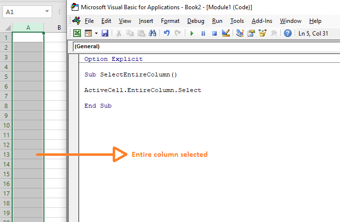
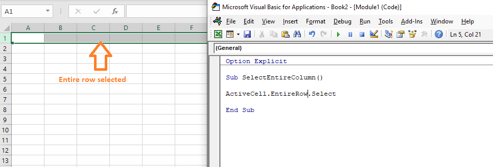

```toc

```

We can select an entire row or an entire column using the ~~EntireRow~~ & ~~EntireColumn~~ properties of the ~~Range~~ object respectively.

### Range.EntireColumn

```vb {numberLines}
Sub SelectEntireColumn()

ActiveCell.EntireColumn.Select

End Sub
```



### Range.EntireRow

```vb {numberLines}
Sub SelectEntireColumn()

ActiveCell.EntireRow.Select

End Sub
```


