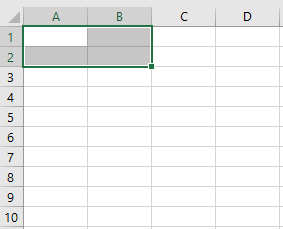

We can resize a specified range using the ~~Range.Resize~~ property, which accepts two optional parameters: **RowSize**(_no. of rows in the new range_) & **ColumnSize**(_no. of new columns in the new range_).

```vb {numberLines}
Sub Resize()

Range("A1").Resize(1, 1).Select

End Sub
```


```vb {numberLines}
Sub Resize()

Range("A1").Resize(2, 2).Select

End Sub
```


