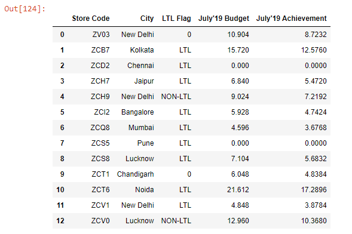
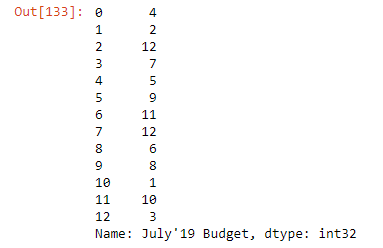
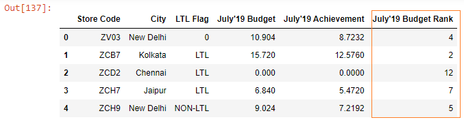
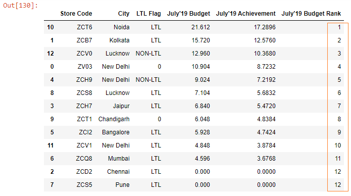

Let’s read an Excel file into a DataFrame:

```py {numberLines}
import pandas as pd

budget = pd.read_excel("budget.xlsx").fillna(value = 0)

budget
```

**Output:**



Let’s say we want to rank the stores based on their July’19 budget numbers. So, the store ZCT6, which has the highest budget number of 21.61 should be ranked 1, the store ZCB7 with a budget of 15.72 should be ranked 2 and so on. You get the idea.

We will use the ~~rank()~~ method to rank the stores.

```py {numberLines}
budget["July'19 Budget"].rank(ascending = False).astype("int")
```

Note that we have passed a value of ~~False~~ to the ~~ascending~~ parameter. This is because we want the stores with higher budget numbers to rank higher.

**Output:**



We got our ranking. Let’s put these ranking numbers in a separate column in our DataFrame.

```py {numberLines}
budget["July'19 Budget Rank"] = budget["July'19 Budget"].rank(ascending = False).astype("int")

budget.head()
```

**Output:**



Next, we will sort the ~~July’19 Budget~~ column in descending order, so that we can see the ranking in ascending order.

###### Learn how to sort a Pandas DataFrame in my blog post [here](https://hemanta.io/sort-a-pandas-dataframe-using-the-sort-values-method/).

```py {numberLines}
budget.sort_values(by = "July'19 Budget", ascending = False)
```

**Output:**


