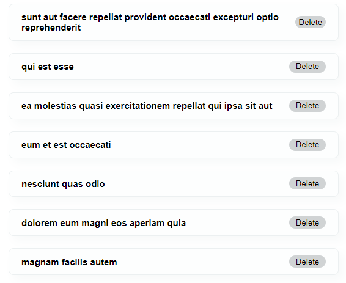

Recently, I discovered an animation library called [AutoAnimate](https://auto-animate.formkit.com/#usage-react) that makes the work of adding smooth animations to React apps effortless. All you need is **just two lines of code** (_I am not kidding_).

Of course, it is not a replacement for a full-fledged option like [Framer Motion](https://www.framer.com/docs/animation/), but it will work like a charm for small scale projects.

### Installation

First, install the package using ~~npm install @formkit/auto-animate~~.

### Import the React Hook

Second, import the React hook ~~useAutoAnimate~~ from ~~@formkit/auto-animate/react~~. This hook returns a ref to apply to the parent element. And that’s it.

If you want to try, you can copy and paste the following code snippets in a React project.

```js:title=src/components/Posts.js {numberLines, 3-3, 8-8,  26-26}
import React, { useState, useEffect } from "react";
import fakeApi from "./api/FakeApi";
import { useAutoAnimate } from "@formkit/auto-animate/react";

const Posts = () => {
  const [posts, setPosts] = useState([]);

  const [parent] = useAutoAnimate();

  useEffect(() => {
    const fetchPosts = async () => {
      const { data } = await fakeApi.get("/posts");

      const tenPosts = data.slice(0, 7);
      setPosts(tenPosts);
    };
    fetchPosts();
  }, []);

  const handleDeletePost = (id) => {
    const filteredPosts = posts.filter((post) => post.id !== id);
    setPosts(filteredPosts);
  };

  return (
    <ul ref={parent}>
      {posts.map((post) => (
        <div className="container" key={post.id}>
          <h2>{post.title}</h2>
          <button onClick={() => handleDeletePost(post.id)}>Delete</button>
        </div>
      ))}
    </ul>
  );
};

export default Posts;
```

```js:title=src/api/FakeApi.js {numberLines}
import axios from "axios";

export default axios.create({
  baseURL: "https://jsonplaceholder.typicode.com",
});
```

```css:title=src/index.css {numberLines}
* {
    padding: 0;
    box-sizing: border-box;
}


html {
    font-size: 62.5%;
    font-family: sans-serif;
}


button {
    width: 6rem;
    height: 2rem;
    background-color: #D0D3D4;
    border: none;
    border-radius: 1rem;
    cursor: pointer;
    margin-left: 1rem;
    transition: all 0.2s;
}

button:hover {
    background-color: #B3B6B7;
}


.container {
    width: 40%;
    background-color: #FDFEFE ;
    border: .1rem solid #ECF0F1;
    border-radius: .8rem;
    display: flex;
    justify-content: space-between;
    align-items: center;
    padding: 0 2rem;
    margin: 0rem auto;
    margin-bottom: 2rem;
    box-shadow: .8rem .8rem 1.5rem #F7F9F9;
    cursor: pointer;
    transition: all 0.2s;
}

.container:hover {
    box-shadow: .2rem .2rem .5rem #F7F9F9;
}
```

The final app should look like this:



Now, click on the ~~Delete~~ button and watch the animation in all its glory.

Give it a go and let me know what you think.
