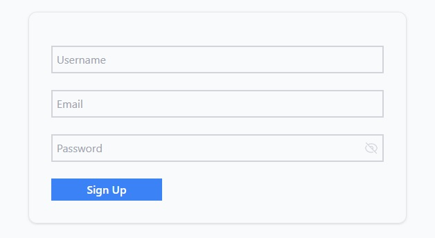
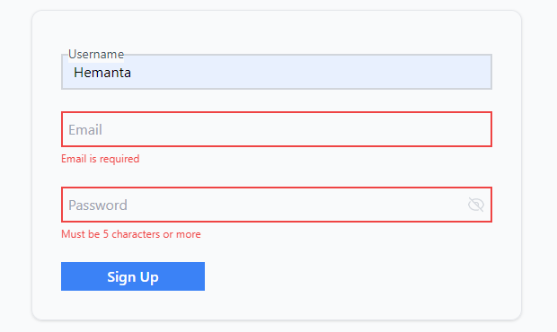

```toc

```

Two libraries that often come up during discussions on React forms are [Formik](https://formik.org/) & [React Hook Form](https://react-hook-form.com/).

Yesterday, I decided to give React Hook Form a try. And I am impressed, to say the least. I think it has a cleaner API and requires less boilerplate code in comparison to Formik. You should give it a go.

The following code snippets are for my own reference.





### Installation

```sh
npm install react-hook-form
```

### Schema-based form validation with yup

```sh
npm install @hookform/resolvers yup
```

### InputUsername.js

```js:title=src/components/shared/inputUsername.js {numberLines, 19-19, 32-32, 41-41, 49-49}
import React from "react";
import { motion, AnimatePresence } from "framer-motion";

const errorVariant = {
  initial: {
    opacity: 0,
    x: "-0.1rem",
  },
  animate: {
    opacity: 1,
    x: "0rem",
  },
  exit: {
    opacity: 0,
    x: "-0.1rem",
  },
};

const InputUsername = ({ register, errors: { username } }) => {
  return (
    <div className="flex flex-col mb-6 relative">
      <input
        className={`peer appearance-none bg-gray-50 border-2 ${
          username
            ? "border-red-500 focus:border-red-500"
            : "border-gray-300 focus:border-blue-500"
        } py-2 px-3 text-gray-700 leading-tight focus:outline-none  placeholder-transparent`}
        placeholder="Username"
        id="username"
        name="username"
        type="username"
        {...register("username")}
      />
      <label
        className="absolute transition-all left-2 -top-2.5 bg-gray-50 text-gray-600 text-sm peer-placeholder-shown:text-base peer-placeholder-shown:text-gray-400 peer-placeholder-shown:top-2 peer-focus:-top-2.5 peer-focus:text-gray-600 peer-focus:text-sm peer-focus:bg-gray-50"
        htmlFor="username"
      >
        Username
      </label>
      <AnimatePresence>
        {username && (
          <motion.span
            variants={errorVariant}
            initial="initial"
            animate="animate"
            exit="initial"
            className="mt-1 text-red-500 text-xs"
          >
            {username.message}
          </motion.span>
        )}
      </AnimatePresence>
    </div>
  );
};

export default InputUsername;
```

### InputEmail.js

```js:title=src/components/shared/inputEmail.js {numberLines, 19-19, 32-32, 41-41, 49-49}
import React from "react";
import { motion, AnimatePresence } from "framer-motion";

const errorVariant = {
  initial: {
    opacity: 0,
    x: "-0.1rem",
  },
  animate: {
    opacity: 1,
    x: "0rem",
  },
  exit: {
    opacity: 0,
    x: "-0.1rem",
  },
};

const InputEmail = ({ register, errors: { email } }) => {
  return (
    <div className="flex flex-col mb-6 relative">
      <input
        className={`peer appearance-none bg-gray-50 border-2 ${
          email
            ? "border-red-500 focus:border-red-500"
            : "border-gray-300 focus:border-blue-500"
        } py-2 px-3 text-gray-700 leading-tight focus:outline-none  placeholder-transparent`}
        placeholder="Email"
        id="email"
        name="email"
        type="email"
        {...register("email")}
      />
      <label
        className="absolute transition-all left-2 -top-2.5 bg-gray-50 text-gray-600 text-sm peer-placeholder-shown:text-base peer-placeholder-shown:text-gray-400 peer-placeholder-shown:top-2 peer-focus:-top-2.5 peer-focus:text-gray-600 peer-focus:text-sm peer-focus:bg-gray-50"
        htmlFor="email"
      >
        Email
      </label>
      <AnimatePresence>
        {email && (
          <motion.span
            variants={errorVariant}
            initial="initial"
            animate="animate"
            exit="initial"
            className="mt-1 text-red-500 text-xs"
          >
            {email.message}
          </motion.span>
        )}
      </AnimatePresence>
    </div>
  );
};

export default InputEmail;
```

### InputPassword.js

```js:title=src/components/shared/inputPassword.js {numberLines, 19-19, 67-67, 76-76, 84-84}
import React, { useState } from "react";
import { motion, AnimatePresence } from "framer-motion";

const errorVariant = {
  initial: {
    opacity: 0,
    x: "-0.1rem",
  },
  animate: {
    opacity: 1,
    x: "0rem",
  },
  exit: {
    opacity: 0,
    x: "-0.1rem",
  },
};

const InputPassword = ({ register, errors: { password } }) => {
  const [eye, setEye] = useState(true);

  return (
    <div className="flex flex-col mb-6 relative">
      {!eye ? (
        <svg
          xmlns="http://www.w3.org/2000/svg"
          viewBox="0 0 20 20"
          fill="currentColor"
          className="absolute top-2.5 right-2 text-gray-300 cursor-pointer w-5 h-5 hover:text-gray-400 transition-all"
          onClick={() => setEye(!eye)}
        >
          <path d="M10 12.5a2.5 2.5 0 100-5 2.5 2.5 0 000 5z" />
          <path
            fill-rule="evenodd"
            d="M.664 10.59a1.651 1.651 0 010-1.186A10.004 10.004 0 0110 3c4.257 0 7.893 2.66 9.336 6.41.147.381.146.804 0 1.186A10.004 10.004 0 0110 17c-4.257 0-7.893-2.66-9.336-6.41zM14 10a4 4 0 11-8 0 4 4 0 018 0z"
            clip-rule="evenodd"
          />
        </svg>
      ) : (
        <svg
          xmlns="http://www.w3.org/2000/svg"
          fill="none"
          viewBox="0 0 24 24"
          stroke-width="1.5"
          stroke="currentColor"
          className="absolute top-2.5 right-2 text-gray-300 cursor-pointer w-5 h-5 hover:text-gray-400 transition-all"
          onClick={() => setEye(!eye)}
        >
          <path
            stroke-linecap="round"
            stroke-linejoin="round"
            d="M3.98 8.223A10.477 10.477 0 001.934 12C3.226 16.338 7.244 19.5 12 19.5c.993 0 1.953-.138 2.863-.395M6.228 6.228A10.45 10.45 0 0112 4.5c4.756 0 8.773 3.162 10.065 7.498a10.523 10.523 0 01-4.293 5.774M6.228 6.228L3 3m3.228 3.228l3.65 3.65m7.894 7.894L21 21m-3.228-3.228l-3.65-3.65m0 0a3 3 0 10-4.243-4.243m4.242 4.242L9.88 9.88"
          />
        </svg>
      )}

      <input
        className={`peer appearance-none bg-gray-50 border-2 ${
          password
            ? "border-red-500 focus:border-red-500"
            : "border-gray-300 focus:border-blue-500"
        } py-2 px-3 text-gray-700 leading-tight focus:outline-none  placeholder-transparent`}
        placeholder="Password"
        id="password"
        name="password"
        type={eye ? "password" : "text"}
        {...register("password")}
      />
      <label
        className="absolute transition-all left-2 -top-2.5 bg-gray-50 text-gray-600 text-sm peer-placeholder-shown:text-base peer-placeholder-shown:text-gray-400 peer-placeholder-shown:top-2 peer-focus:-top-2.5 peer-focus:text-gray-600 peer-focus:text-sm peer-focus:bg-gray-50"
        htmlFor="password"
      >
        Password
      </label>
      <AnimatePresence>
        {password && (
          <motion.span
            variants={errorVariant}
            initial="initial"
            animate="animate"
            exit="initial"
            className="mt-1 text-red-500 text-xs"
          >
            {password.message}
          </motion.span>
        )}
      </AnimatePresence>
    </div>
  );
};

export default InputPassword;
```

### SignUp.js

```js:title=src/components/SignUp.js {numberLines, 2-4, 9-24, 27-34, 36-39, 45-45}
import React from "react"
import { useForm } from "react-hook-form"
import * as yup from "yup"
import { yupResolver } from "@hookform/resolvers/yup"
import InputUsername from "./shared/InputUsername"
import InputEmail from "./shared/InputEmail"
import InputPassword from "./shared/InputPassword"

const schema = yup
  .object({
    username: yup
      .string()
      .max(10, "Must be less than 10 characters")
      .required("Username is required"),
    email: yup
      .string()
      .email("Invalid email address")
      .required("Email is required"),
    password: yup
      .string()
      .min(5, "Must be 5 characters or more")
      .required("Password is required"),
  })
  .required()

const SignUp = () => {
  const {
    reset,
    register,
    handleSubmit,
    formState: { errors },
  } = useForm({
    resolver: yupResolver(schema),
  })

  const onSubmit = data => {
    console.log(data)
    reset()
  }

  return (
    <>
      <form
        className="shadow border rounded-xl w-11/12 md:w-3/5 xl:w-2/5 flex flex-col mt-24 m-auto"
        onSubmit={handleSubmit(onSubmit)}
      >
        <div className="flex flex-col">
          <div className="mx-8 mt-12">
            <InputUsername register={register} errors={errors} />
            <InputEmail register={register} errors={errors} />
            <InputPassword register={register} errors={errors} />
            <div className="flex justify-between items-center mb-8">
              <button
                type="submit"
                className=" w-40 bg-blue-500 text-white font-medium px-2 py-1 hover:bg-blue-600 hover:shadow-md"
              >
                Sign Up
              </button>
            </div>
          </div>
        </div>
      </form>
    </>
  )
}
export default SignUp
```

### App.js

```js {numberLines}
import React from "react"
import SignUp from "./components/SignUp"

const App = () => {
  return <SignUp />
}

export default App
```
