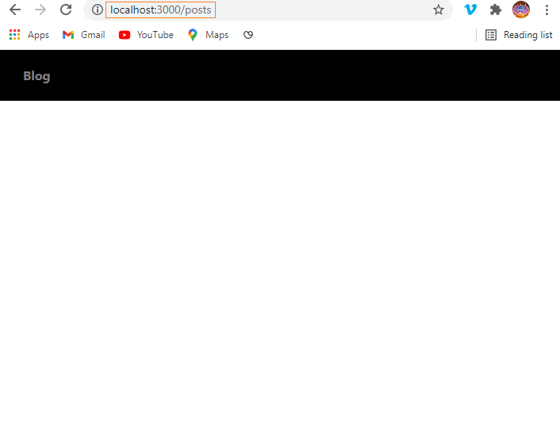
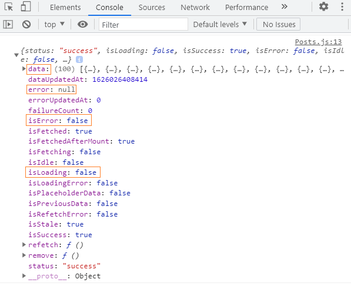
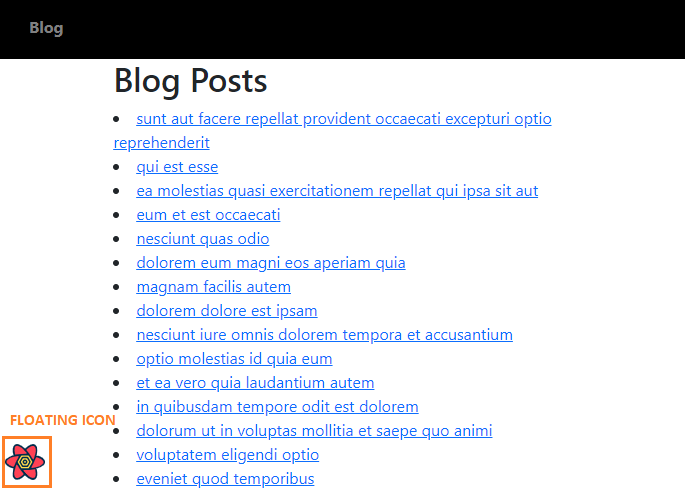

```toc

```

React Query is a **server-state management library**.

**What is server-state**?

In a typical react application, the client fetches data from the server in order to render UIs. **We refer to this data stored on the server as server-state**.

React Query fetches, caches and updates this server-state without touching any global state. In addition, with React Query, you can write the data fetching and caching logic of your application in just a few lines of code, drastically reducing the boilerplate that you would otherwise have to write in global state management libraries such as Redux or Redux Toolkit. More importantly, React Query handles caching and other important features (_which we will discover soon_) out-of-the-box with zero configuration.

**So, if I use React Query, will I still need to use an application state management library such as Redux or Redux Toolkit**?

Once you take care of the server-state using React Query, the data that can be considered as truly global for your application is really small, which you can manage using a combination of ~~useState~~, ~~useReducer~~, ~~useContext~~ and component composition methods.

Having said that, if your application has large amounts of client-state that requires complex update logic, you can use a global state management library of your choice, in addition to React Query.

**What is client-state**?

Client-state or UI state can be defined as the state responsible for managing the interactive parts of your app. For example modal ~~isOpen~~ state.

Once you understand that there are essentially two types of state (client-state & server-state) and that managing asynchronous operations between the client and the server is a different set of concerns than state management, you will be able to appreciate all the benefits that React Query brings to the table and follow all the latest discussions happening around application state management in React.

Now that you have a broader understanding of React Query, we will now understand how to fetch data from server by building a small application.

### Project walk-through

Our application will have a navigation bar with a ~~Blog~~ link. When we click on this link, we go to the ~~/posts~~ route, where we render the ~~Posts~~ page, which displays a list of blog posts fetched from JSONPlaceholder, a fake REST API.


When we click on an individual post title, we render the respective ~~Post~~ page, where we display the ~~title~~ and ~~body~~ of the post.


We will use ~~react-router-dom~~ for client-side routing, Bootstrap classes & CSS for styling and of course React Query for managing the server-state of our application.

Let's get started.

Create a folder named ~~blog~~, open the folder in VS Code and create a React project using the following command.

```sh
PS C:\Users\Delhivery\Desktop\blog> npx create-react-app .
```

We will install all the dependencies we need.

```sh
PS C:\Users\Delhivery\Desktop\blog> npm i bootstrap axios react-router-dom @tanstack/react-query
```

Next, we will import Bootstrap minified CSS in the ~~index.js~~ file, above the ~~index.css~~ import.

```jsx {numberLines, 3}
import React from "react"
import ReactDOM from "react-dom"
import "bootstrap/dist/css/bootstrap.min.css"
import "./index.css"
import App from "./App"

ReactDOM.render(
  <React.StrictMode>
    <App />
  </React.StrictMode>,
  document.getElementById("root")
)
```

### Creating the navigation bar

Now, we will create the navigation bar.

In the ~~src~~ folder, create a folder called ~~components~~. And in the ~~components~~ folder, create a file called ~~Navbar.js~~.

```jsx:title=src/components/Navbar.js {numberLines}
import React from "react";
import { Link } from "react-router-dom";

const Navbar = () => {
  return (
    <nav>
      <ul>
        <li>
          <Link to="/posts">Blog</Link>
        </li>
      </ul>
    </nav>
  );
};

export default Navbar;
```

Add the following CSS rules in ~~index.css~~.

```jsx:title=src/index.css {numberLines}
* {
  padding: 0;
  margin: 0;
  box-sizing: border-box;
}
html {
  font-family: sans-serif;
}

nav {
  width: 100%;
  height: 4rem;
  background-color: black;
}

nav ul {
  width: 100%;
  height: 100%;
  list-style-type: none;
  display: flex;
  align-items: center;
}

nav ul a {
  text-decoration: none;
  font-weight: 700;
}

nav ul a:link,
nav ul a:visited {
  color: gray;
  transition: all 0.3s;
}

nav ul a:hover {
  color: white;
}
```

Next, we will render the ~~Navbar~~ component inside the ~~App~~ component.

```jsx:title=src/App.js {numberLines}
import React from "react";
import Navbar from "./components/Navbar";

const App = () => {
  return (
    <div>
      <Navbar />
    </div>
  );
};

export default App;
```

We have used the ~~Link~~ component from ~~react-router-dom~~ inside the ~~Navbar~~ component; therefore we will have to wrap the top-level ~~App~~ component with the ~~BrowserRouter~~ component.

Update the ~~index.js~~ file as follows:

```jsx:title=src/index.js {numberLines, 6-6, 9-9, 11-11}
import React from "react";
import ReactDOM from "react-dom";
import "bootstrap/dist/css/bootstrap.min.css";
import "./index.css";
import App from "./App";
import { BrowserRouter as Router } from "react-router-dom";

ReactDOM.render(
  <Router>
    <App />
  </Router>,
  document.getElementById("root")
);
```

With this, the navigation bar is now ready. When we click on the ~~Blog~~ Link, we are taken to the ~~/posts~~ route, where we will render the ~~Posts~~ component (_which we haven't created yet_).



### Creating a query client

As we have already discussed, the ~~Posts~~ component will render a list of blog posts. We will use the ~~useQuery~~ hook from React Query to fetch this list of posts from JSONPlaceholder, a fake REST API.

Before we can use ~~useQuery~~, we will have to create a query client and provide that client to our app.

Update the ~~index.js~~ file as follows:

```jsx:title=src/index.js {numberLines, 7-7, 9-9, 13-13, 15-15}
import React from "react";
import ReactDOM from "react-dom";
import "bootstrap/dist/css/bootstrap.min.css";
import "./index.css";
import App from "./App";
import { BrowserRouter as Router } from "react-router-dom";
import { QueryClient, QueryClientProvider } from "@tanstack/react-query";

const queryClient = new QueryClient();

ReactDOM.render(
  <Router>
    <QueryClientProvider client={queryClient}>
      <App />
    </QueryClientProvider>
  </Router>,
  document.getElementById("root")
);
```

Now, inside the ~~components~~ folder, create a file called ~~Posts.js~~.

```jsx:title=src/components/Posts.js {numberLines}
import React from "react";
import axios from "axios";
import { useQuery } from "@tanstack/react-query";

const Posts = () => {
  const queryResult = useQuery(["posts"], async () => {
    const { data } = await axios.get(
      `https://jsonplaceholder.typicode.com/posts`
    );
    return data;
  });

  console.log(queryResult);

  return <div></div>;
};

export default Posts;
```

### useQuery hook

To fetch data from a server, we use the ~~useQuery~~ hook, which we have imported from ~~react-query~~ on line 3.

The ~~useQuery~~ hook has the following signature:

```sh
useQuery(queryKey, queryFn, config);
```

### Query key

The first argument to ~~useQuery~~ is a unique key for the query.

The key can be an individual string. It can also be an array with a string.

In the code snippet above, we have used the array format (~~["posts"]~~) of the query key. This means that the query inside the ~~Posts~~ component is tied to the ~~posts~~ key, which will be used for refetching, caching and sharing the query throughout the application. This will be clear when we inspect our queries in React Query Dev Tools, which we have not imported yet from ~~react-query~~.

> When we pass a string query key, it is converted to an array internally with the string as the only item in the query key.

### Query function

The second argument to ~~useQuery~~ is a query function that returns a promise that resolves the data or throws an error. If the quey function throws an error, it is available as ~~error.message~~.

The query function is where we have made a HTTP ~~GET~~ request to the JSONPlaceholder ~~/posts~~ API endpoint using axios (an HTTP client).

> React query does not invoke the query function on every re-render. A component can rerender for various reasons, so, fetching everytime would be insane.

The query result returned by ~~useQuery~~ contains all the information about the query. On line 13, we have logged the ~~queryResult~~ variable to the console, but we can't see anything on the console because we have not yet rendered the ~~Posts~~ component.

Let's render the ~~Posts~~ component inside the ~~App~~ component.

```jsx:title=src/App.js {numberLines, 3-4, 10-14}
import React from "react";
import Navbar from "./components/Navbar";
import Posts from "./components/Posts";
import { Switch, Route } from "react-router-dom";

const App = () => {
  return (
    <div>
      <Navbar />
      <Switch>
        <Route exact path="/posts">
          <Posts />
        </Route>
      </Switch>
    </div>
  );
};

export default App;
```

Now, if we check our console, we see the following result:



For most queries, it's usually sufficient to check for the ~~isLoading~~ state, then the ~~isError~~ state, then finally, assume that the data is available and render the successful state.

When we make an API call, we can view its progress as follows:

- **The request is in progress.** This is when we show a loader/spinner to the user.

- **The request succeeds.** We get the data we need.

- **The request fails.** We show the error message.

Add the highlighted code snippets in the ~~Posts.js~~ file.

```jsx:title=src/components/Posts.js {numberLines, 4-4, 7-17, 20-37}
import React from "react";
import axios from "axios";
import { useQuery } from "@tanstack/react-query";
import { Link } from "react-router-dom";

const Posts = () => {
  const {
    isLoading,
    isError,
    error,
    data: posts,
  } = useQuery(["posts"], async () => {
    const { data } = await axios.get(
      `https://jsonplaceholder.typicode.com/posts`
    );
    return data;
  });

  return (
    <div className="col-8 col-md-6 mx-auto">
      <h1>Blog Posts</h1>
      {isLoading ? (
        <div className="d-flex justify-content-center">
          <div className="spinner-border" role="status">
            <span className="sr-only"></span>
          </div>
        </div>
      ) : isError ? (
        <p>{error.message}</p>
      ) : (
        posts?.map((post) => (
          <li key={post.id}>
            <Link to={`/posts/${post.id}`}>{post.title}</Link>
          </li>
        ))
      )}
    </div>
  );
};

export default Posts;
```

We have destructured ~~isLoading~~, ~~isError~~, ~~error~~ and ~~data~~ properties from the object returned by the ~~useQuery~~ hook. Note that we have renamed the ~~data~~ property to ~~posts~~.

Then, if ~~isLoading~~ is true, we show a spinner; if ~~isError~~ is true, we show the error message, else, we map through the ~~posts~~ array and show the post titles.

The result is as follows:


We have successfully fetched a list of 100 blog posts from a fake REST API endpoint and displayed it in the ~~Posts~~ component, in just a few lines of code.

### React query dev tools

However, to truly understand how React Query is managing our ~~posts~~ query internally, we must inspect our query inside React Query Dev Tools.

First, we will install React Query devtools.

```sh
PS C:\Users\Delhivery\Desktop\blog> npm i @tanstack/react-query-devtools
```

We can import ~~ReactQueryDevTools~~ from ~~react-query/devtools~~ and **place it as high as we can** in our app.

Update the ~~index.js~~ file as follows:

```jsx:title=src/index.js {numberLines, 7-7, 16-16}
import React from "react";
import ReactDOM from "react-dom";
import "bootstrap/dist/css/bootstrap.min.css";
import "./index.css";
import App from "./App";
import { QueryClient, QueryClientProvider } from "@tanstack/react-query";
import { ReactQueryDevtools } from "@tanstack/react-query-devtools";
import { BrowserRouter as Router } from "react-router-dom";

const queryClient = new QueryClient();

ReactDOM.render(
  <Router>
    <QueryClientProvider client={queryClient}>
      <App />
      <ReactQueryDevtools initialIsOpen={false} />
    </QueryClientProvider>
  </Router>,
  document.getElementById("root")
);
```

With this, we will see a floating icon on the lower left corner of the screen as shown below:



This icon provides a toggle to show and hide the dev tools.

> By default, Recat Query Dev Tools are not included in production bundles.

Now, click on the icon and open the dev tools. When we click on the ~~posts~~ query key, we will see one more panel open in the right, where we will see the list of blog posts that we fetched from the ~~/posts~~ API endpoint. We can say that the posts list is cached under the ~~posts~~ query key. Now, refresh the page. You will notice that the state of the query changes from ~~fetching~~ to ~~stale~~.


### Refetch on window focus

At this stage, you must understand about one default behavior that React Query comes with out of the box. Stale queries are refetched automatically in the background when window is refocused or the network is reconnected.

To understand what I am talking about, we will import the ~~isFetching~~ property from the object returned by the ~~useQuery~~ hook and use it to show the text ~~Updating...~~, when the query is being refetched.

Update the ~~Posts.js~~ file as follows:

```jsx:title=src/components/Posts.js {numberLines, 8-8, 23-23}
import React from "react";
import axios from "axios";
import { useQuery } from "@tanstack/react-query";
import { Link } from "react-router-dom";

const Posts = () => {
  const {
    isFetching,
    isLoading,
    isError,
    error,
    data: posts,
  } = useQuery(["posts"], async () => {
    const { data } = await axios.get(
      `https://jsonplaceholder.typicode.com/posts`
    );
    return data;
  });

  return (
    <div className="col-8 col-md-6 mx-auto">
      <h1>Blog Posts</h1>
      {isFetching && "Updating..."}
      {isLoading ? (
        <div className="d-flex justify-content-center">
          <div className="spinner-border" role="status">
            <span className="sr-only"></span>
          </div>
        </div>
      ) : isError ? (
        <p>{error.message}</p>
      ) : (
        posts?.map((post) => (
          <li key={post.id}>
            <Link to={`/posts/${post.id}`}>{post.title}</Link>
          </li>
        ))
      )}
    </div>
  );
};

export default Posts;
```

Now, click on a different tab and come back to the tab where our application is running and you will see a flash of the text ~~Updating...~~. This is because, React Query, by default, refetches stale queries in the background on window refocus in order to make sure that the data remains up to date.

We can turn off this behavior by setting ~~refetchOnWindowFocus~~ to ~~false~~ in the config object, which is passed as the third argument to the ~~useQuery~~ hook.

Update the ~~Posts.js~~ component as follows:

```jsx:title=src/index.js {numberLines, 21-23}
import React from "react";
import axios from "axios";
import { useQuery } from "react-query";
import { Link } from "react-router-dom";

const Posts = () => {
  const {
    isFetching,
    isLoading,
    isError,
    error,
    data: posts,
  } = useQuery(
    ["posts"],
    async () => {
      const { data } = await axios.get(
        `https://jsonplaceholder.typicode.com/posts`
      );
      return data;
    },
    {
      refetchOnWindowFocus: false,
    }
  );

  return (
    <div className="col-8 col-md-6 mx-auto">
      <h1>Blog Posts</h1>
      {isFetching && "Updating..."}
      {isLoading ? (
        <div className="d-flex justify-content-center">
          <div className="spinner-border" role="status">
            <span className="sr-only"></span>
          </div>
        </div>
      ) : isError ? (
        <p>{error.message}</p>
      ) : (
        posts?.map((post) => (
          <li key={post.id}>
            <Link to={`/posts/${post.id}`}>{post.title}</Link>
          </li>
        ))
      )}
    </div>
  );
};

export default Posts;
```

Now, if you click on a different tab and come back to the tab where our application is running, you will not see the text ~~Updating...~~ anymore.

Moving forward, when we click on the title of the blog posts, the route changes to ~~/posts/postId~~. We don't see anything on the screen because we have not created a page for individual blog posts yet. Let's do that now.

In the ~~components~~ folder, create a file called ~~Post.js~~.

```jsx:title=src/components/Post.js {numberLines}
import React from "react";
import axios from "axios";
import { useParams } from "react-router-dom";
import { useQuery } from "react-query";

const Post = () => {
  const { postId } = useParams();

  const {
    isLoading,
    isError,
    error,
    data: post,
  } = useQuery(["posts", postId], async () => {
    const { data } = await axios.get(
      `https://jsonplaceholder.typicode.com/posts/${postId}`
    );
    return data;
  });

  return (
    <div className="col-8 col-md-6 mx-auto">
      {isLoading ? (
        <div className="d-flex justify-content-center">
          <div className="spinner-border" role="status">
            <span className="sr-only"></span>
          </div>
        </div>
      ) : isError ? (
        <p>{error.message}</p>
      ) : (
        <article>
          {" "}
          <h2>{post.title}</h2>
          <p>{post.body}</p>
        </article>
      )}
    </div>
  );
};

export default Post;
```

Since query keys uniquely describe the data they are fetching, they should include any variables we use in your query function that change. In our case, ~~postId~~ changes whenever we click on different blog posts. This is why we have included the ~~postId~~ variable in our query key (~~["posts", postid]~~).

> More importantly, whenever the query key changes, React Query will trigger a refetch. You can think of the query key as the dependency array of the ~~useEffect~~ hook.

Next, update the ~~App.js~~ file.

```jsx:title=src/App.js {numberLines, 3-3, 15-17}
import React from "react";
import Posts from "./components/Posts";
import Post from "./components/Post";
import Navbar from "./components/Navbar";
import { Switch, Route } from "react-router-dom";

const App = () => {
  return (
    <div>
      <Navbar />
      <Switch>
        <Route exact path="/posts">
          <Posts />
        </Route>
        <Route exact path="/posts/:postId">
          <Post />
        </Route>
      </Switch>
    </div>
  );
};

export default App;
```

Now, when we click on any blog post title, we see the post details.


We can see that the post is cached under the query key ~~["posts", 1]~~. (_We clicked on the first post, so the ~~postId~~ is ~~1~~._)

We know that React Query caches the data fetched from server. This means that the first time we click on any blog post, we will see a spinner. But if we click on the same post again, we will not see any loading spinner, because the second time, React Query will instantly load the post saved in the cache.

### Scroll restoration

Before I close this post, let's talk about scroll restoration.

In React Query, built-in scroll restoration just works as long as the data is being cached.

To understand what I mean, click on the 100th post, then click on the back button of the browser. The browser will scroll down to where you were at the start - the 100th post.

### Conclusion

So, as you can see, React Query is extremely powerful. With this post, I have only scratched the surface of all the cool features that React Query comes packed with. I recently started learning React Query and I am super impressed. I recommend that you take a look at the [documentation](https://react-query.tanstack.com/) and start incorporating React Query in your React apps to manage the server-state.

###### Understand staleTime in React Query in my blog post [here](https://hemanta.io/understanding-stale-time-in-react-query/).
