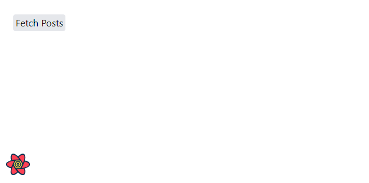
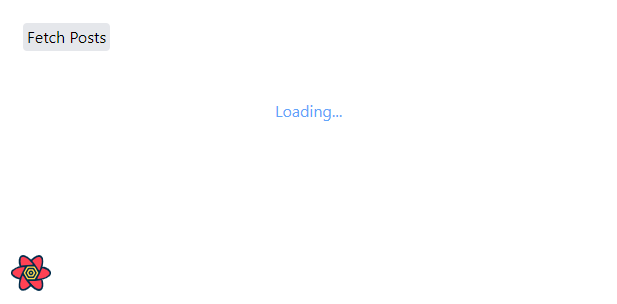
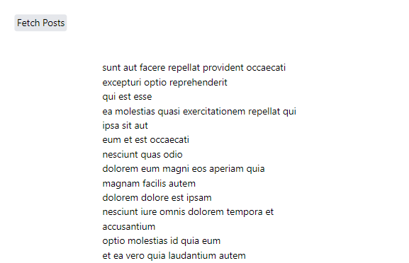

So, here is what we want.

We have a ~~Fetch Posts~~ button.



When we click on this button, we want to fetch and display a list of blog posts from a fake REST API using the ~~useQuery~~ hook from React Query. In other words, we want to disable the query until we click on the ~~FetchPosts~~ button.

We can achieve this using two steps.

First, we set the ~~enabled~~ key to ~~false~~.

> Remember the signature of the ~~useQuery~~ hook? It looks like this: ~~useQuery(queryKey, queryFn, config)~~. We can pass a config object as the third argument to the ~~useQuery~~ hook. This is where we add ~~enabled: false~~.

Second, we use the ~~refetch~~ function returned from ~~useQuery~~ to manually trigger the fetch.

Let's look at our code:

```jsx:title=src/components/Posts.js {numberLines, 12-12, 21-21, 27-27}
import React from "react"
import { useQuery } from "@tanstack/react-query"
import axios from "axios"

const Posts = () => {
  const {
    data: posts,
    isFetching,
    isLoading,
    isError,
    error,
    refetch,
  } = useQuery(
    ["posts"],
    async () => {
      const { data } = await axios.get(
        `https://jsonplaceholder.typicode.com/posts`
      )
      return data
    },
    { enabled: false }
  )

  return (
    <>
      <button
        onClick={() => refetch()}
        className="bg-gray-200 hover:bg-gray-300 rounded m-6 px-1 py-0.5 "
      >
        Fetch Posts
      </button>

      <h1 className="mb-6 text-blue-400 text-center">
        {isFetching && "Fetching posts...."}
      </h1>

      {posts ? (
        posts.map(post => (
          <h1 className="w-1/2 m-auto" key={post.title}>
            {post.title}
          </h1>
        ))
      ) : isLoading ? (
        <h1 className="text-blue-400 text-center">Loading...</h1>
      ) : isError ? (
        <h1>{error.message}</h1>
      ) : (
        ""
      )}
    </>
  )
}

export default Posts
```

We have **PERMANENTLY disabled** the query from automatically running. The query will now run when we click on the ~~Fetch Posts~~ button, which will call the ~~refetch~~ function, which in turn will trigger the fetch.

Note that Permanently disabling the query has several consequences. One of them is:

- The query will not refetch in the background.

> You can find out what happens when we set ~~enabled~~ to ~~false~~ in the offical React Query docs [here](https://tanstack.com/query/v4/docs/guides/disabling-queries).

We have run into another issue: we have the text ~~Loading...~~ on the screen.



This happens because when we disable the query, the query is in ~~status: `loading`~~ state right from the start, because ~~loading~~ means there is no data yet. For scenarios like these, React Query provides a ~~isInitialLoading~~ flag, which we can use to show a spinner. The flag will be true if the query is fetching for the first time.

Let's change ~~isLoading~~ to ~~isInitialLoading~~:

```jsx:title=src/components/Posts.js {numberLines, 9-9, 43-43}
import React from "react"
import { useQuery } from "@tanstack/react-query"
import axios from "axios"

const Posts = () => {
  const {
    data: posts,
    isFetching,
    isInitialLoading,
    isError,
    error,
    refetch,
  } = useQuery(
    ["posts"],
    async () => {
      const { data } = await axios.get(
        `https://jsonplaceholder.typicode.com/posts`
      )
      return data
    },
    { enabled: false }
  )

  return (
    <>
      <button
        onClick={() => refetch()}
        className="bg-gray-200 hover:bg-gray-300 rounded m-6 px-1 py-0.5 "
      >
        Fetch Posts
      </button>

      <h1 className="mb-6 text-blue-400 text-center">
        {isFetching && "Fetching posts...."}
      </h1>

      {posts ? (
        posts.map(post => (
          <h1 className="w-1/2 m-auto" key={post.title}>
            {post.title}
          </h1>
        ))
      ) : isInitialLoading ? (
        <h1 className="text-blue-400 text-center">Loading...</h1>
      ) : isError ? (
        <h1>{error.message}</h1>
      ) : (
        ""
      )}
    </>
  )
}

export default Posts
```

Click on the ~~FetchPosts~~ button and we have our posts:



Now, if we click on a different tab and come back to the tab where our React app is running, we will not see the text ~~Fetching posts....~~. That's because we have set ~~enabled~~ to ~~false~~, which has disabled background refetching of our query.

We are now successfully fetching data on the click of a button.

We have achieved our objective. Or have we?

Remember what we said at the start? We said that we want to disable the query UNTIL we click on the ~~FetchPosts~~ button. In other words, the query should be enabled after we click on the button. But we have permanently disabled our query. So, we have got to make some changes.

All we need to do is set the value of the ~~enabled~~ key to a boolean.

```jsx:title=src/components/Posts.js {numberLines, 6-6, 23-23, 27-27, 34-34}
import React, { useState } from "react"
import { useQuery } from "@tanstack/react-query"
import axios from "axios"

const Posts = () => {
  const [fetch, setFetch] = useState(false)

  const {
    data: posts,
    isFetching,
    isInitialLoading,
    isError,
    error,
    refetch,
  } = useQuery(
    ["posts"],
    async () => {
      const { data } = await axios.get(
        `https://jsonplaceholder.typicode.com/posts`
      )
      return data
    },
    { enabled: fetch }
  )

  const handleFetchPosts = () => {
    setFetch(true)
    refetch()
  }

  return (
    <>
      <button
        onClick={handleFetchPosts}
        className="bg-gray-200 hover:bg-gray-300 rounded m-6 px-1 py-0.5 "
      >
        Fetch Posts
      </button>

      <h1 className="mb-6 text-blue-400 text-center">
        {isFetching && "Fetching posts...."}
      </h1>

      {posts ? (
        posts.map(post => (
          <h1 className="w-1/2 m-auto" key={post.title}>
            {post.title}
          </h1>
        ))
      ) : isInitialLoading ? (
        <h1 className="text-blue-400 text-center">Loading...</h1>
      ) : isError ? (
        <h1>{error.message}</h1>
      ) : (
        ""
      )}
    </>
  )
}

export default Posts
```

The initial value of ~~enabled~~ is ~~false~~. When we click the ~~Fetch Posts~~ button, we change the value to ~~true~~.

Now, if we go to a different tab and come back to the tab where our app is running, we see the text ~~Fetching posts....~~. Background refetching on window refocus is working.

Great.

We have one last change to make before we are done.

We never keep the data fetching logic and the UI logic in the same component. What we will do is: we will extract the data fetching logic to a custom hook and use that hook in the ~~Posts~~ component.

```jsx {numberLines}
import { useQuery } from "@tanstack/react-query"
import axios from "axios"

export const usePostHook = fetch => {
  return useQuery(
    ["posts", fetch],
    async () => {
      const { data } = await axios.get(
        `https://jsonplaceholder.typicode.com/posts`
      )
      return data
    },
    { enabled: fetch }
  )
}

export default usePostHook
```

```jsx:title=src/components/Posts.js {numberLines, 2-2, 7-14}
import React, { useState } from "react"
import { usePostHook } from "./hooks/postHook"

const Posts = () => {
  const [fetch, setFetch] = useState(false)

  const {
    data: posts,
    isFetching,
    isInitialLoading,
    isError,
    error,
    refetch,
  } = usePostHook(fetch)

  const handleFetchPosts = () => {
    setFetch(true)
    refetch()
  }

  return (
    <>
      <button
        onClick={handleFetchPosts}
        className="bg-gray-200 hover:bg-gray-300 rounded m-6 px-1 py-0.5 "
      >
        Fetch Posts
      </button>

      <h1 className="mb-6 text-blue-400 text-center">
        {isFetching && "Fetching posts...."}
      </h1>

      {posts ? (
        posts.map(post => (
          <h1 className="w-1/2 m-auto" key={post.title}>
            {post.title}
          </h1>
        ))
      ) : isInitialLoading ? (
        <h1 className="text-blue-400 text-center">Loading...</h1>
      ) : isError ? (
        <h1>{error.message}</h1>
      ) : (
        ""
      )}
    </>
  )
}

export default Posts
```

We can go one step further & instead of managing a local state in the ~~Posts~~ component, we can manage the state in the ~~usePostHook~~ itself.

This would look something like this:

```jsx {numberLines, 1-1, 6-6, 18-18}
import { useState } from "react"
import { useQuery } from "@tanstack/react-query"
import axios from "axios"

export const usePostHook = () => {
  const [fetch, setFetch] = useState(false)
  const queryResult = useQuery(
    ["posts", fetch],
    async () => {
      const { data } = await axios.get(
        `https://jsonplaceholder.typicode.com/posts`
      )
      return data
    },
    { enabled: fetch }
  )

  return [() => setFetch(true), queryResult]
}

export default usePostHook
```

```jsx:title=src/components/Posts.js {numberLines, 2-2, 5-8, 11-11}
import React from "react"
import { usePostHook } from "./hooks/postHook"

const Posts = () => {
  const [
    setFetch,
    { data: posts, isFetching, isInitialLoading, isError, error, refetch },
  ] = usePostHook()

  const handleFetchPosts = () => {
    setFetch()
    refetch()
  }

  return (
    <>
      <button
        onClick={handleFetchPosts}
        className="bg-gray-200 hover:bg-gray-300 rounded m-6 px-1 py-0.5 "
      >
        Fetch Posts
      </button>

      <h1 className="mb-6 text-blue-400 text-center">
        {isFetching && "Fetching posts...."}
      </h1>

      {posts ? (
        posts.map(post => (
          <h1 className="w-1/2 m-auto" key={post.title}>
            {post.title}
          </h1>
        ))
      ) : isInitialLoading ? (
        <h1 className="text-blue-400 text-center">Loading...</h1>
      ) : isError ? (
        <h1>{error.message}</h1>
      ) : (
        ""
      )}
    </>
  )
}

export default Posts
```

And now, we are done.

If you want to get notified when I publish a new blog post or want to about know the projects I am working on and the tech I am exploring, consider subscribing to my weekly newsletter below.
