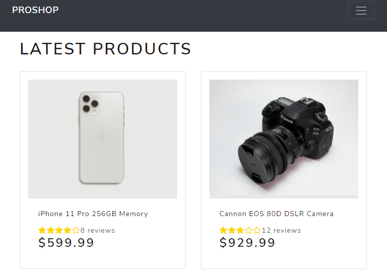
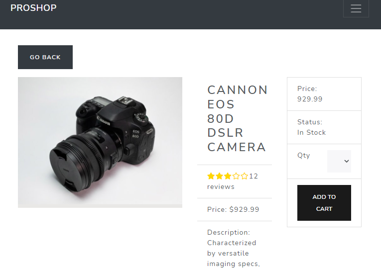
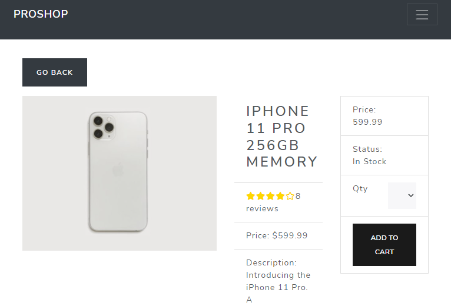
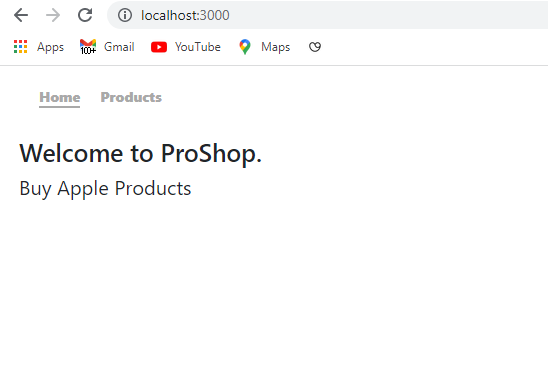
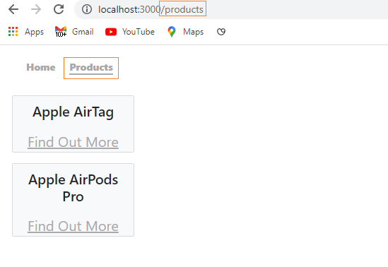
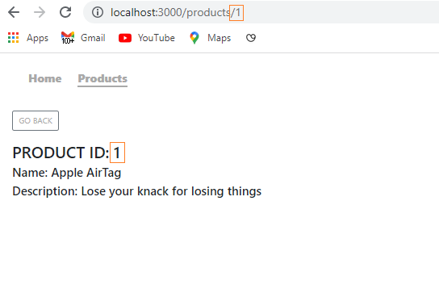
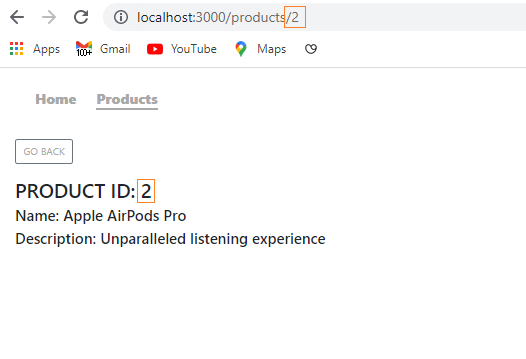

```toc

```

###### Learn the fundamentals of React router in my blog post [here](https://hemanta.io/introduction-to-react-router/).

The picture below is the home page of a shopping site that sells electronic items:



The home page displays a list of products.

When we click on a product, we are taken to a product details page that displays information regarding that specific product. The product details page has the same structure for all the products but the data is different.





How can we create dynamic pages for every single product, as shown above?

The answer is: by using URL params.

The general steps can be described as follows:

- Every product is identified by a unique ID. Whenever we click on a product, we display the product ID in the URL.
- Then, we figure out a way to extract the product ID from the URL (we will use the ~~useParams~~ hook to extract the product ID from the URL).
- Once we know the product ID, we can display the relevant information for that specific product on the product details page.

We will learn to display dynamic pages for products (by extracting the product IDs from the URL, using the ~~useParams()~~ hook) by building a simple React app.

### Creating a React app

Create a folder named ~~react-router~~, open the folder in Visual Studio Code and create a React project using ~~create-react-app~~.

```sh {numberLines}
PS C:\Users\Delhivery\Desktop\react-router> npx create-react-app .
```

Install ~~react-router-dom~~ and ~~bootstrap~~.

```sh {numberLines}
PS C:\Users\Delhivery\Desktop\react-router> npm i react-router-dom bootstrap
```

Next, in the ~~index.js~~ file import Bootstrap CSS above ~~index.css~~ and wrap the ~~\<App/>~~ component with ~~BrowserRouter~~.

```jsx:title=src/index.js {numberLines, 3-3, 9-9, 11-11}
import React from "react";
import ReactDOM from "react-dom";
import "bootstrap/dist/css/bootstrap.min.css";
import "./index.css";
import App from "./App";
import { BrowserRouter as Router } from "react-router-dom";

ReactDOM.render(
  <Router>
    <App />
  </Router>,
  document.getElementById("root")
);
```

In the ~~src~~ folder, create a folder named ~~components~~ and in the ~~components~~ folder, create 4 files: ~~Home.js~~, ~~Header.js~~, ~~Products.js~~, ~~ProductDetails.js~~, & ~~SingleProuductView.js~~.

```jsx:title=src/components/Home.js {numberLines}
import React from "react";

const Home = () => {
  return (
    <div>
      <h1 className="font-weight-bold">Welcome to ProShop. </h1>
      <p>Buy Apple Products</p>
    </div>
  );
};

export default Home;
```

```jsx:title=src/components/Header.js {numberLines}
import React from "react";
import { NavLink } from "react-router-dom";

const Header = () => {
  return (
    <nav>
      <ul>
        <li>
          <NavLink to="/" exact activeClassName="selected">
            Home
          </NavLink>
        </li>
        <li>
          <NavLink to="/products" activeClassName="selected">
            Products
          </NavLink>
        </li>
      </ul>
    </nav>
  );
};

export default Header;
```

```jsx:title=src/components/Products.js {numberLines}
import React, { useContext } from "react";
import ProductDetails from "./ProductDetails";
import { productContext } from "../App";

const Products = () => {
  const products = useContext(productContext);
  return (
    <div>
      {products.map((product) => (
        <ProductDetails key={product.id} product={product} />
      ))}
    </div>
  );
};

export default Products;
```

```jsx:title=src/components/ProductDetails.js {numberLines}
import React from "react";
import { Link } from "react-router-dom";

const ProductDetails = ({ product }) => {
  return (
    <div className="card bg-light text-center w-25 mb-4">
      <div className="card-body">
        <h2 className="card-title">{product.name}</h2>
      </div>
      <Link to={`/products/${product.id}`}>Find Out More</Link>
    </div>
  );
};

export default ProductDetails;
```

```jsx:title=src/components/SingleProductView.js {numberLines, 2-2, 8-8, 14-14}
import React, { useContext } from "react";
import { Link, useParams } from "react-router-dom";
import { productContext } from "../App";

const SingleProductView = () => {
  const products = useContext(productContext);

  const { id } = useParams();

  const {
    id: productID,
    name,
    description,
  } = products.find((product) => product.id === Number.parseInt(id));

  return (
    <div>
      <Link to={`/products`} className="btn btn-outline-secondary mb-4">
        GO BACK
      </Link>
      <h2>PRODUCT ID: {productID}</h2>
      <h4>Name: {name}</h4>
      <h4>Description: {description}</h4>
    </div>
  );
};

export default SingleProductView;
```

### useParams()

**LINE 2:** We import ~~useParams~~ as a named import from ~~react-router-dom~~.

**LINE 8:** We call the hook at the top of the component with ~~const params = useParams()~~. It always returns an object containing all the URL parameters from the URL as key/value pairs.

**LINE 14:** We have converted the ~~id~~ extracted from the URL from a string to a number using ~~Number.parseInt()~~.

> Note: URL parameter values are always strings. That’s because they are written in URL and URL is a string.

###### Learn how to use ~~Number.parseInt()~~ in my blog post [here](https://hemanta.io/how-to-reverse-an-integer-in-javascript/).

Next, copy and paste the following code in the ~~App.js~~ file.

```jsx:title=src/App.js {numberLines, 32-32}
import React, { createContext } from "react";
import Products from "./components/Products";
import Home from "./components/Home";
import Header from "./components/Header";
import SingleProductView from "./components/SingleProductView";
import { Switch, Route } from "react-router-dom";

export const productContext = createContext();

const App = () => {
  const products = [
    {
      id: 1,
      name: "Apple AirTag",
      description: "Lose your knack for losing things",
    },
    {
      id: 2,
      name: "Apple AirPods Pro",
      description: "Unparalleled listening experience",
    },
  ];

  return (
    <productContext.Provider value={products}>
      <Header />
      <main>
        <Switch>
          <Route path="/products" exact>
            <Products />
          </Route>
          <Route path="/products/:id" exact>
            <SingleProductView />
          </Route>
          <Route path="/" exact>
            <Home />
          </Route>
        </Switch>
      </main>
    </productContext.Provider>
  );
};

export default App;
```

Note that the path is ~~/products/:id~~. The ~~:id~~ is a placeholder for the **id** that we will be able to read as a variable.

The syntax for describing URL parameters in React Router is the colon (~~:~~). For example, ~~:id~~ or ~~:name~~. The colon (~~:~~) character instructs React Router that we should not be looking exactly for ~~:id~~ but for any text that comes after ~~/products/~~.

Then, copy and paste the following style rules in ~~index.css~~.

```css:title=src/index.css {numberLines}
* {
  margin: 0;
  padding: 0;
  box-sizing: border-box;
}

html {
  font-family: sans-serif;
  font-size: 62.5%;
}

nav {
  width: 40rem;
  margin: 2rem;
  margin-bottom: 3rem;
}

nav ul {
  width: 100%;
  display: flex;
  justify-content: flex-start;
  list-style: none;
}

nav li {
  font-size: 1.4rem;
  margin-right: 2rem;
}

nav a {
  font-weight: 900;
  text-decoration: none;
}

nav a:link,
a:visited {
  color: darkgray;
}

nav a:hover {
  color: black;
}

.selected {
  border-bottom: 0.2rem solid darkgray;
}

main {
  margin: 2rem;
  font-size: 2rem;
}
```

Start the development server with ~~npm start~~ and we have our application ready.








