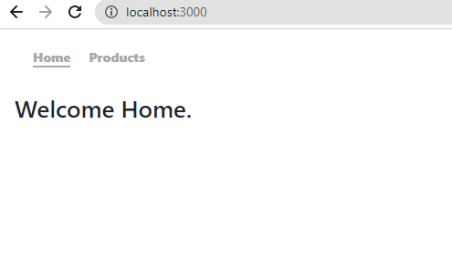
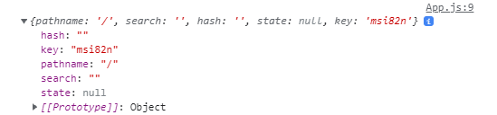
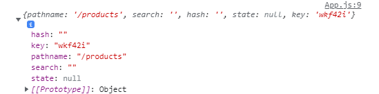

###### Master the fundamentals of React Router in my blog post [here](https://hemanta.io/introduction-to-react-router/).

We can find out the **currently** active route using the ~~useLocation~~ hook.

Our app below has two routes: ~~/~~ & ~~/products~~.



In the code example below, on line 9, we are logging the value of the ~~location~~ variable to the console.

```js {numberLines, 5-5, 8-9}
import React from "react"
import Home from "./components/Home"
import Header from "./components/Header"
import Products from "./components/Products"
import { Switch, Route, Redirect, useLocation } from "react-router-dom"

const App = () => {
  const location = useLocation()
  console.log(location)

  return (
    <>
      <Header />
      <main>
        <Switch>
          <Route path="/products" exact>
            <Products />
          </Route>
          <Route path="/" exact>
            <Home />
          </Route>
          <Redirect to="/" />
        </Switch>
      </main>
    </>
  )
}

export default App
```

When we click on ~~Home~~, we get the following result logged to the console:



And when we click on ~~Products~~, we get the following result:



Clearly, the ~~pathname~~ property of the object is the current active route.

> When using the ~~useLocation~~ hook, we must make sure that the code is running inside a component wrapped by the ~~<BrowserRouter \/>~~ component.
