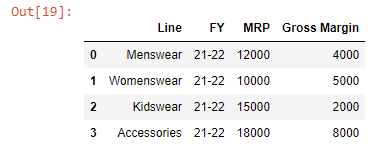

```toc

```

### Reading an Excel file with a single worksheet

Let’s say we have an Excel file named ~~sales.xlsx~~ and the file contains a single worksheet named ~~Data~~.


We can read the data inside the file into a ~~DataFrame~~ using the ~~read_excel()~~ method as shown below:

```py {numberLines}
import pandas as pd
```

```py {numberLines}
df = pd.read_excel("sales.xlsx")
df.head()
```


### Reading an Excel file with multiple worksheets

Let’s say we have an Excel file named ~~budget.xlsx~~ and the file contains 2 worksheets: ~~ZoneWise~~ & ~~LineWise~~.


If we read the data inside the file, pandas, by default, will read the first sheet: ~~ZoneWise~~.

But what if we want to read the ~~LineWise~~ sheet?

We can do so by passing the name of the second sheet to the ~~sheet_name~~ parameter, as shown below:

```py {numberLines}
df = pd.read_excel("sales.xlsx", sheet_name="LineWise")
df.head()
```



We can read both the sheets inside the ~~budget.xlsx~~ file by passing the sheet names inside a list object to the ~~sheet_name~~ parameter.

```py {numberLines}
budget = pd.read_excel("budget.xlsx", sheet_name=["ZoneWise", "LineWise"])
budget
```

The result is going to be a dictionary.


As we can see, the keys of the dictionary are the names of the worksheets.

We can read a specific worksheet as follows:

```py {numberLines}
budget["ZoneWise"]
```


What if we have hundreds of worksheets in the file?

Then, writing the names of the worksheets manually is not a feasible option. In such cases, we can pass the value of ~~None~~ to the ~~sheet_name~~ parameter.

```py {numberLines}
budget = pd.read_excel("budget.xlsx", sheet_name= None)
```
