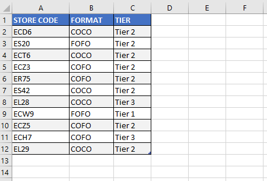

```toc

```

Let’s say we have the following data set in a table.



We can reference the table as ~~ActiveSheet.Range("store_details").Select~~. (_~~store_details~~ is the name of the table._)

However, we have access to more of the properties and methods that are unique to tables if we use the ~~ListObjects~~ object.

### Range

```vb {numberLines}
Sub TableDemo()

ActiveSheet.ListObjects(1).Range.Select

End Sub
```

**Result:**


### DataBodyRange

```vb {numberLines}
Sub TableDemo()

ActiveSheet.ListObjects(1).DataBodyRange.Select

End Sub
```

**Result:**


### HeaderRowRange

```vb {numberLines}
Sub TableDemo()

ActiveSheet.ListObjects(1).HeaderRowRange.Select

End Sub
```

**Result:**


### Referencing specific columns

We can reference a specific column using the header name of the column.

The following example selects _only_ the data of the ~~FORMAT~~ column of the table.

```vb {numberLines}
Sub TableDemo()

ActiveSheet.ListObjects(1).ListColumns("FORMAT").DataBodyRange.Select

End Sub
```

**Result:**


### Convert a table to range

The following procedure converts the table in the active sheet to range.

```vb {numberLines}
Sub TableToRange()
 Dim wrksht As Worksheet

 Set wrksht = ActiveSheet

 wrksht.ListObjects(1).Unlist
End Sub
```
