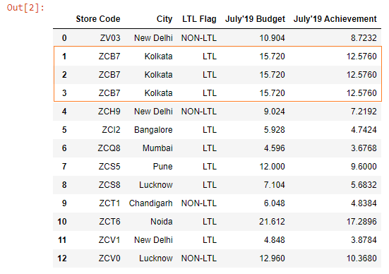
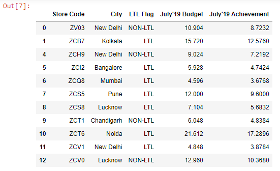

Let’s read the ~~budget.xlsx~~ file into a DataFrame.

```py {numberLines}
import pandas as pd

budget = pd.read_excel("budget.xlsx")

budget
```

**Output:**



We can see that we have duplicate rows in our DataFrame.

We can remove them using the ~~drop_duplicates()~~ method.

```py {numberLines}
budget.drop_duplicates(inplace = True)

budget
```

**Output:**



The duplicate rows have been removed.

###### Learn how to find duplicate rows in a pandas DataFrame in my blog post [here](https://hemanta.io/find-duplicate-rows-in-a-pandas-dataframe/).
