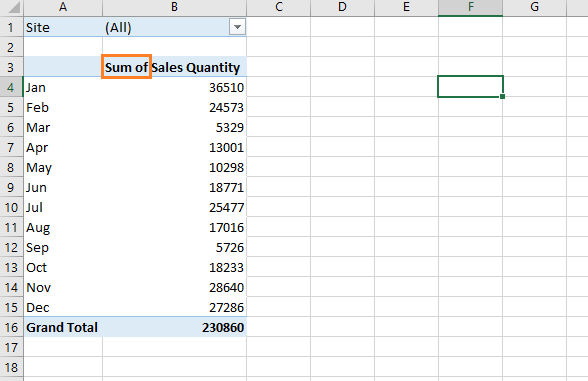
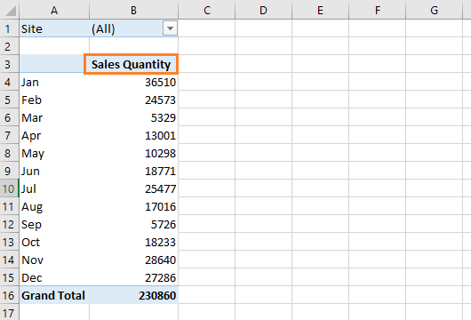

Below, we have aggregated (month-wise) the sales quantity for a particular retail store using a pivot table.



Notice how the pivot table has added the phrase ~~Sum of~~ to the ~~Sales Quantity~~ value field heading.

We can remove this phrase from all the value field headings in a PivotTable using the following macro:

```vb {numberLines}
Sub removeSumOf()

  Dim pf As PivotField

  Dim pt As PivotTable

  Set pt = ActiveSheet.PivotTables(1)

  For Each pf In pt.DataFields
    pf.Caption = pf.SourceName & " "
  Next pf

End Sub
```

Executing the macro gives us the following result:


