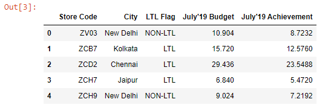
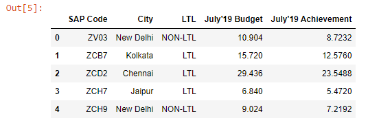

Below, we have read an Excel file into a DataFrame.

```py {numberLines}
import pandas as pd

budget = pd.read_excel("budget.xlsx")
budget.head()
```

**Output:**



Let’s say we want to rename ~~Store Code~~ to ~~SAP Code~~ and ~~LTL Flag~~ to ~~LTL~~. We can do so using the ~~rename()~~ method.

```py {numberLines}
budget.rename(columns={"Store Code" : "SAP Code", "LTL Flag" : "LTL"}, inplace = True)
```

We pass a Python Dictionary to the ~~columns~~ parameter.

The keys of the dictionary are the column names that we want to change and the values are the names that we want the column names to change to. In addition, we pass ~~inplace = True~~ in order to make the change permanent.

Now, if we preview the ~~budget~~ DataFrame, we can see that the column names are changed.

```py {numberLines}
budget.head()
```


