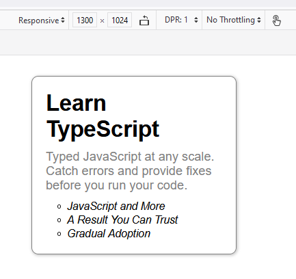
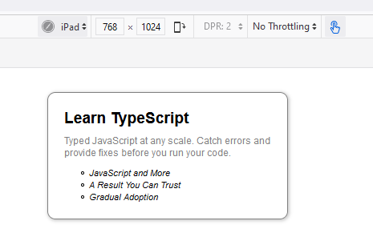
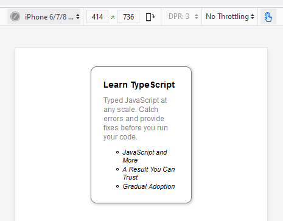

Without writing media queries, we can make font sizes responsive with just a single line of code, using the CSS ~~clamp()~~ function.

With ~~clamp()~~, font sizes dynamically scale with the size of the viewport, but do not go below a minimum font-size or above a maximum font size.

We can use the ~~clamp()~~ function for sizing other design elements as well.

The ~~clamp()~~ function takes three parameters in a specific order:

- The first argument specifies the minimum value. If the preferred value (the second argument) is less than this value, then the minimum value will be used.
- The second argument specifies the preferred value. This value is used as long as it is greater than the value of the first argument (lower bound) and less than the value of the third argument (upper bound).
- The third argument specifies the maximum value. This value is the largest value that the property will be set to.

Let’s create a card using the ~~clamp()~~ function.

```jsx:title=src/App.js {numberLines}
import React from "react"

const App = () => {
  return (
    <div className="card">
      <h2>Learn TypeScript</h2>
      <p>
        Typed JavaScript at any scale. Catch errors and provide fixes before you
        run your code.
      </p>
      <ul>
        <li>JavaScript and More</li>
        <li>A Result You Can Trust</li>
        <li>Gradual Adoption</li>
      </ul>
    </div>
  )
}

export default App
```

```css:title=src/index.css {numberLines, 13-13, 22-22, 27-27, 39-39}
* {
  padding: 0;
  margin: 0;
  box-sizing: border-box;
}

html {
  font-size: 62.5%;
  font-family: sans-serif;
}

.card {
  width: clamp(15rem, 40vw, 30rem);
  padding: 2rem;
  border: 0.1rem solid gray;
  border-radius: 1rem;
  margin: 3rem auto 0 auto;
  box-shadow: 0.1rem 0.1rem 0.4rem 0.1rem rgba(0, 0, 0, 0.2);
}

h2 {
  font-size: clamp(1.4rem, 2.5vw, 6rem);
  margin-bottom: 1rem;
}

p {
  font-size: clamp(1.2rem, 1.4vw, 2.5rem);
  margin-bottom: 1rem;
  color: gray;
}

ul {
  list-style-type: circle;
}

ul li {
  padding: 0.1rem;
  margin-left: 3rem;
  font-size: clamp(1.1rem, 1.2vw, 2rem);
  font-style: italic;
}
```

In the code snippet above, we have set the width of the card and font sizes of the heading, paragraph and list items using the ~~clamp()~~ function.

> **Note**: The value of the viewport width (~~VW~~) unit is relative to the viewport width, so 1.5vw, for example, is 1.5% of the width of the viewport.

If we open the card in responsive design mode in a browser, and take a look at the card at different viewport sizes, we will see that the font sizes and the card width dynamically scale with the size of the viewport. And the best part is we haven't used media queries at all.

#### On viewport sized 1330px X 1024px



#### On iPad



#### On iPhone 6/7/8


