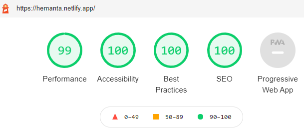

I have decided to do a monthly review of my progarmming journey from this month onwards. So, here is everything I did in May.

I had set two goals at the start of the month:

- Create a new blog using a static site generator
- Move all the blog posts from WordPress to the new blog

The only problem was that I did not have any prior experience in using static site generators. I just had a theoretical understanding of what they were. So, my strategy was to try out a few before picking one to build my blog with.

I had heard great things about Gatsby. The sites built using Gatsby were super fast. I had also heard rave reviews about another static site generator named 11ty. In order to get a feel for both, I decided to follow the tutorials on their official sites.

First, I started with the tutorial on the official Gatsby website.

Gatsby uses React and GraphQL under the hood. But I did not know much about GraphQL except for a high-level understanding of the language. Nevertheless, I decided that I would figure the GraphQL parts out as I go along.

The React parts of the tutorial were an absolute breeze. However, the GraphQL parts were not making much sense, as expected. I also had a hard time understanding the concept of Gatsby Node APIs. I could get stuff working but did not really understand what was going on. I could not explain the code to somebody else.

I decided to purchase some Gatsby courses on Udemy in the hope that they would clarify my concepts. I had planned to go back to the tutorial afte finishing a course or two. I ended up purchasing three courses and they were all crap. I was disappointed, a bit frustrated and I did not go back and finish the tutorial.

Then I decided to give 11ty a shot. I started with the tutorial on the official site but could not make much progress. I was disappointed by the poor documentation and did not really feel like doing any research. So, I just quit. And I was not in the mood to try out another static site generator.

Then I decided to give Next.js a try. I started off with the tutorial on their official site. I did manage to build a bare-bones version of the blog. I even finished a Next.js course that I had purchased from Udemy. But I struggled to add features to my blog. I could not find much resource on the internet.

Now, I did not know what to do. 11ty and Next.js were out of my consideration for sure simply because of the lack of robust documentation.

I wanted to give Gatsby another try.

I started again with the official tutorial, but this time I took things slow in order for the concepts to sink in. I finished the tutorial and managed to build a blog to my satisfaction. I was also able to implement additional features by following the detailed guides on the official Gatsby site. Their documentation is excellent. And in case you don't find anything on the official site, you would surely find blog posts that would help you solve the problem. You would never struggle with finding resources when it comes to Gatsby.

After that, I spent a few days tinkering with the design and the layout. Once I was happy with the result, I moved all of my blog posts from WordPress to Gatsby and hosted the new blog on Netlify. I did a lighthouse audit and the scores were excellent.

In June, I will completely focus my efforts on GraphQL. The plan is to finish the React-GraphQL course that I have bought on Udemy. I want to get a solid grasp on GraphQL, so that I can build advanced stuff using Gatsby. I will also finish the initial draft of a multi-part blog series on how to build a developer blog using Gatsby and markdown. I will update on my progress in the June review blog post.

Adios, until then.
